# Build Site — Token Efficiency Initiative

135 tasks across 6 tiers from 11 kits. Source: context/refs/research-brief-token-efficiency.md.

---

## Tier 0 — No Dependencies (Start Here)

| Task | Title | Cavekit | Requirement | Effort |
|------|-------|---------|-------------|--------|
| T-001 | Define `CachePolicy` shape and layered breakpoint ordering contract | cavekit-prompt-cache.md | R1 | M |
| T-002 | Assemble tools/system/project/messages layers in strict order | cavekit-prompt-cache.md | R1 | M |
| T-003 | Enforce single breakpoint per layer and layer-isolation byte stability | cavekit-prompt-cache.md | R1 | M |
| T-004 | Implement deterministic alphabetically-sorted tool schema serializer | cavekit-prompt-cache.md | R2 | M |
| T-005 | Add snapshot test for byte-stable tool schema SHA256 across 1000 runs | cavekit-prompt-cache.md | R2 | S |
| T-006 | Assert per-tool description edits isolate to tools-layer hash and strip paths/timestamps | cavekit-prompt-cache.md | R2 | S |
| T-007 | Enforce append-only message history invariant in session writer | cavekit-prompt-cache.md | R4 | M |
| T-008 | Add 20-turn compaction immutability integration test | cavekit-prompt-cache.md | R4 | S |
| T-009 | Define role tag set `plan|edit|explore|verify` on every agent LLM call | cavekit-model-routing.md | R1 | M |
| T-010 | Assert every outbound call carries exactly one role or test-fails | cavekit-model-routing.md | R1 | S |
| T-011 | Introduce `ModelRouter` interface and default config-backed implementation | cavekit-model-routing.md | R2 | M |
| T-012 | Wire agent loop to call router for every outbound request and allow test swap | cavekit-model-routing.md | R2 | M |
| T-013 | Enforce router determinism: no time/randomness in decision path | cavekit-model-routing.md | R4 | S |
| T-014 | Expose `--router-profile`, `--plan-model`, `--edit-model` plain CLI flags | cavekit-model-routing.md | R6 | M |
| T-015 | Fold CaveKit `PRESET_MODELS` into a single routing profile (no double-routing) | cavekit-model-routing.md | R7 | M |
| T-016 | Implement macOS Seatbelt sandbox profile for bash tool | cavekit-sandbox-mcp.md | R1 | M |
| T-017 | Block writes outside workdir, network, and sensitive HOME paths under Seatbelt | cavekit-sandbox-mcp.md | R1 | M |
| T-018 | Implement Linux Landlock sandbox wrapper with kernel 5.13 detection | cavekit-sandbox-mcp.md | R2 | M |
| T-019 | Emit Windows startup unsupported-sandbox warning and run permissive | cavekit-sandbox-mcp.md | R3 | S |
| T-020 | Add `cave mcp serve` MCP server mode exposing built-in tool surface | cavekit-sandbox-mcp.md | R6 | M |
| T-021 | Implement ACP handshake, message streaming, and tool call forwarding | cavekit-sandbox-mcp.md | R7 | M |
| T-022 | Document skills/subagents/hooks trinity as in-process extension surface | cavekit-sandbox-mcp.md | R8 | S |
| T-023 | Implement shadow-git checkpoint repo at `~/.cave/checkpoints/<session>/.git` | cavekit-session-checkpoints.md | R1 | M |
| T-024 | Auto-commit on workdir-mutating tool calls tagged to session entry ID | cavekit-session-checkpoints.md | R1 | M |
| T-025 | Guarantee no conflict with existing `SessionManager` and JSONL v3 schema | cavekit-session-checkpoints.md | R8 | S |
| T-026 | Build LLMLingua-2 ONNX middleware via `onnxruntime-node` | cavekit-input-compression.md | R1 | M |
| T-027 | Build Provence reranker-pruner middleware over chunk lists | cavekit-input-compression.md | R2 | M |
| T-028 | Implement tool result cache keyed by `(tool, args, git-sha+mtime+size)` | cavekit-tool-result-cache.md | R1 | M |
| T-029 | Scope result cache to session ID with two-session isolation test | cavekit-tool-result-cache.md | R1 | S |
| T-030 | Implement tool output normalization (paths, ANSI, whitespace, timestamps) | cavekit-tool-result-cache.md | R2 | M |
| T-031 | Verify normalization produces byte-identical blocks across wall-clock runs | cavekit-tool-result-cache.md | R2 | S |
| T-032 | Build tree-sitter parser layer for TS, JS, Python, Go, Rust, Java, C, C++ | cavekit-repomap.md | R1 | L |
| T-033 | Emit filename+line-count fallback entries for unsupported languages | cavekit-repomap.md | R1 | S |
| T-034 | Construct `CostEntry` accounting struct and per-provider pricing table | cavekit-cost-trace.md | R1 | M |
| T-035 | Support user pricing table override via config | cavekit-cost-trace.md | R1 | S |
| T-036 | Emit append-only trace JSONL at `~/.cave/sessions/<id>.trace.jsonl` | cavekit-cost-trace.md | R5 | M |
| T-037 | Add size-threshold rotation-safe JSONL writer | cavekit-cost-trace.md | R5 | S |
| T-038 | Implement `apply_sr_diff` exact-match search/replace tool | cavekit-edit-tools.md | R1 | M |
| T-039 | Add SWE-bench-style 100-edit fixture asserting ≥95% apply success | cavekit-edit-tools.md | R1 | M |
| T-040 | Return structured `no_match`/`ambiguous` diagnostics from `apply_sr_diff` | cavekit-edit-tools.md | R1 | S |

---

## Tier 1 — Depends on Tier 0

| Task | Title | Cavekit | Requirement | blockedBy | Effort |
|------|-------|---------|-------------|-----------|--------|
| T-041 | Unify `CachePolicy` consumption across all `packages/ai` provider adapters | cavekit-prompt-cache.md | R7 | T-001 | L |
| T-042 | Add provider parity test for 4-layer request against all cache-capable adapters | cavekit-prompt-cache.md | R7 | T-041 | M |
| T-043 | Ensure no-cache-support adapters return `cached_input_tokens=0` cleanly | cavekit-prompt-cache.md | R7 | T-041 | S |
| T-044 | Surface `cached_input_tokens`/`cache_write_tokens`/`uncached_input_tokens` in unified usage | cavekit-prompt-cache.md | R8 | T-041 | M |
| T-045 | Add replay-twice hit-reporting test asserting cached tokens rise on 2nd call | cavekit-prompt-cache.md | R8 | T-044 | S |
| T-046 | Verify `cached + uncached = total` input-token invariant | cavekit-prompt-cache.md | R8 | T-044 | S |
| T-047 | Expose per-task `CacheRetention` at agent-loop call site with role defaults | cavekit-prompt-cache.md | R3 | T-001, T-009 | M |
| T-048 | Honor `--cache=long|short|none` CLI flag overriding per-call retention | cavekit-prompt-cache.md | R3 | T-047 | S |
| T-049 | Respect CaveKit phase retention override precedence over role default | cavekit-prompt-cache.md | R3 | T-047, T-015 | S |
| T-050 | Implement cache-aware middle-drop trimming with N-recent-turn floor | cavekit-prompt-cache.md | R5 | T-007 | M |
| T-051 | Replace dropped span with deterministic stable summary block | cavekit-prompt-cache.md | R5 | T-050 | M |
| T-052 | Assert tools/system/project layer bytes unchanged across a trim | cavekit-prompt-cache.md | R5 | T-050 | S |
| T-053 | Implement opt-in keepalive pings with idle-2x-interval shutoff | cavekit-prompt-cache.md | R6 | T-047 | M |
| T-054 | Suppress keepalive under retention=none and default-off behavior | cavekit-prompt-cache.md | R6 | T-053 | S |
| T-055 | Implement default routing profile: plan/edit/explore/verify tiers and retentions | cavekit-model-routing.md | R3 | T-011, T-047 | M |
| T-056 | Validate per-role override honoring in default profile | cavekit-model-routing.md | R3 | T-055 | S |
| T-057 | Fresh-install plain-CLI split asserting plan vs edit hit different models | cavekit-model-routing.md | R6 | T-014, T-055 | S |
| T-058 | Regression-test CaveKit phase→model mapping under new router | cavekit-model-routing.md | R7 | T-015, T-055 | S |
| T-059 | Build symbol graph with function/class/type/exported-const kinds and reference edges | cavekit-repomap.md | R2 | T-032 | M |
| T-060 | Assert `(file, line, kind, signature)` fields present for every symbol node | cavekit-repomap.md | R2 | T-059 | S |
| T-061 | Run PageRank over symbol reference graph with deterministic ordering | cavekit-repomap.md | R3 | T-059 | M |
| T-062 | Scale top-K to token budget and drop lowest-rank symbols first | cavekit-repomap.md | R3 | T-061 | S |
| T-063 | Implement caveman-style renderer with full-prose `--repomap-style=full` toggle | cavekit-repomap.md | R4 | T-061 | M |
| T-064 | Assert caveman style fits ≥30% more symbols than full at equal budget | cavekit-repomap.md | R4 | T-063 | S |
| T-065 | Enforce byte-stable rendering: repo-relative paths, no timestamps, tie-break keys | cavekit-repomap.md | R5 | T-063 | M |
| T-066 | Assert twice-invocation produces byte-identical output on clean tree | cavekit-repomap.md | R5 | T-065 | S |
| T-067 | Add session-scoped incremental refresh cache keyed on git HEAD + mtime | cavekit-repomap.md | R6 | T-065 | M |
| T-068 | Enforce configurable interval-based cache invalidation | cavekit-repomap.md | R6 | T-067 | S |
| T-069 | Respect configurable token budget with no mid-symbol truncation | cavekit-repomap.md | R7 | T-061 | S |
| T-070 | Inject repomap into project context layer after CLAUDE.md, before user context | cavekit-repomap.md | R8 | T-002, T-065 | M |
| T-071 | Verify removing repomap leaves tools/system layer bytes unchanged | cavekit-repomap.md | R8 | T-070 | S |
| T-072 | Implement read-cache invalidation on write/edit and bash allowlist semantics | cavekit-tool-result-cache.md | R3 | T-028 | M |
| T-073 | Add grep-invalidation-after-edit test and bash-allowlist test | cavekit-tool-result-cache.md | R3 | T-072 | S |
| T-074 | Enforce allowlist-driven bypass for bash/network/time-dependent tools | cavekit-tool-result-cache.md | R4 | T-028 | S |
| T-075 | Assert call-site cannot force caching for bypassed tools | cavekit-tool-result-cache.md | R4 | T-074 | S |
| T-076 | Implement token-bounded LRU eviction preserving emitted message bytes | cavekit-tool-result-cache.md | R5 | T-028 | M |
| T-077 | Assert eviction is no-op on entries used within current turn | cavekit-tool-result-cache.md | R5 | T-076 | S |
| T-078 | Enforce activation-threshold passthrough for small blocks | cavekit-input-compression.md | R3 | T-026, T-027 | S |
| T-079 | Enforce compression-output determinism so cache is not busted | cavekit-input-compression.md | R4 | T-026, T-027 | S |
| T-080 | Add opt-in config and per-call flag, never compressing tools/system/user-typed | cavekit-input-compression.md | R5 | T-078 | M |
| T-081 | Download ONNX models on first use to `~/.cave/models/` with checksum gate | cavekit-input-compression.md | R6 | T-026, T-027 | M |
| T-082 | Assert distributed binary contains no `.onnx` files and never touches models dir when disabled | cavekit-input-compression.md | R6 | T-081 | S |
| T-083 | Implement per-turn cost cap mid-stream cancellation with `cost_cap_turn` event | cavekit-cost-trace.md | R2 | T-034, T-036 | M |
| T-084 | Require user confirmation on next turn after a cap fires | cavekit-cost-trace.md | R2 | T-083 | S |
| T-085 | Implement per-session cost cap aggregating subagent cost with `cost_cap_session` event | cavekit-cost-trace.md | R3 | T-083 | M |
| T-086 | Build `/cost` slash command live panel with hit-rate formula | cavekit-cost-trace.md | R4 | T-034 | M |
| T-087 | Stream-update cost panel as calls complete | cavekit-cost-trace.md | R4 | T-086 | S |
| T-088 | Implement `cave trace <session>` terminal viewer with filter-by-type | cavekit-cost-trace.md | R6 | T-036 | M |
| T-089 | Render LLM-call rows with model/tokens/dollars and tool-call cache state | cavekit-cost-trace.md | R6 | T-088 | S |
| T-090 | Implement `cave replay <rollout>` deterministic re-execution with `--apply` gate | cavekit-cost-trace.md | R7 | T-036, T-013 | M |
| T-091 | Record `(turn_index, source_message_ids)` provenance on every memory/summary entry | cavekit-cost-trace.md | R8 | T-036 | M |
| T-092 | Surface provenance in trace viewer and test-fail on unknown source | cavekit-cost-trace.md | R8 | T-091, T-088 | S |
| T-093 | Emit `tool_cache_hit`/`tool_cache_miss` trace events with saved-tokens estimate | cavekit-tool-result-cache.md | R6 | T-028, T-036 | S |
| T-094 | Expose running `cached_tool_results` counter to cost panel | cavekit-tool-result-cache.md | R6 | T-093, T-086 | S |
| T-095 | Implement `edit_symbol(file, qualified_name, new_body)` via AST traversal | cavekit-edit-tools.md | R2 | T-032 | L |
| T-096 | Preserve signature line and support nested qualified names across 8 languages | cavekit-edit-tools.md | R2 | T-095 | M |
| T-097 | Return `unsupported_language` for files outside top-8 | cavekit-edit-tools.md | R2 | T-095 | S |
| T-098 | Return `ambiguous` candidate list when qualified name matches multiple symbols | cavekit-edit-tools.md | R3 | T-095 | S |
| T-099 | Implement atomic write with temp+rename and parse-failure rollback | cavekit-edit-tools.md | R4 | T-038, T-095 | M |
| T-100 | Return structured parse diagnostic field on write failure | cavekit-edit-tools.md | R4 | T-099 | S |
| T-101 | Emit `(file, hunks[])` diff payload with before/after/lineRange for both new tools | cavekit-edit-tools.md | R5 | T-038, T-095 | M |
| T-102 | Expose `edit`, `apply_sr_diff`, `edit_symbol` simultaneously with intended-use descriptions | cavekit-edit-tools.md | R6 | T-038, T-095 | S |
| T-103 | Add snapshot test for byte-stable `apply_sr_diff` and `edit_symbol` schemas | cavekit-edit-tools.md | R7 | T-004, T-038, T-095 | S |
| T-104 | Implement atomic rewind: checkout + JSONL truncate + branch-summary reconstruction | cavekit-session-checkpoints.md | R2 | T-023 | L |
| T-105 | Assert truncation-failure rollback and missing-entry-id error path | cavekit-session-checkpoints.md | R2 | T-104 | S |
| T-106 | Implement Esc-Esc keybinding and interactive rewind picker with summary diffs | cavekit-session-checkpoints.md | R3 | T-104 | M |
| T-107 | Implement `cave resume` fuzzy picker over `~/.cave/sessions/` with metadata rows | cavekit-session-checkpoints.md | R4 | T-023 | M |
| T-108 | Re-enter selected session at its head with shadow repo attached | cavekit-session-checkpoints.md | R4 | T-107 | S |
| T-109 | Implement plan mode blocking write/edit/bash and preserving grep/read | cavekit-session-checkpoints.md | R5 | T-023 | M |
| T-110 | Persist plan-mode state across turns until explicit exit | cavekit-session-checkpoints.md | R5 | T-109 | S |
| T-111 | Implement checkpoint GC retention policy with active-session protection | cavekit-session-checkpoints.md | R7 | T-023 | M |
| T-112 | Register MCP client connecting to `~/.cave/mcp.json` servers into tool surface | cavekit-sandbox-mcp.md | R5 | T-004 | M |
| T-113 | Forward model MCP tool calls and surface structured errors on missing servers | cavekit-sandbox-mcp.md | R5 | T-112 | M |
| T-114 | Assert MCP tool schemas serialize byte-stably under deterministic serializer | cavekit-sandbox-mcp.md | R5 | T-112, T-004 | S |
| T-115 | Implement `sandbox.allow:` config block for read/write/network escapes | cavekit-sandbox-mcp.md | R4 | T-016, T-018 | M |
| T-116 | Prompt interactively on per-tool-call sandbox escape | cavekit-sandbox-mcp.md | R4 | T-115 | S |
| T-117 | Emit `compression_fallback` trace event on model load or inference failure | cavekit-input-compression.md | R7 | T-081, T-036 | S |

---

## Tier 2 — Depends on Tier 1

| Task | Title | Cavekit | Requirement | blockedBy | Effort |
|------|-------|---------|-------------|-----------|--------|
| T-118 | Implement hunk-level inline review UI consuming edit-tools diff payload | cavekit-session-checkpoints.md | R6 | T-101 | M |
| T-119 | Support review-each, review-batch, auto-accept modes with byte-identical reject | cavekit-session-checkpoints.md | R6 | T-118 | M |
| T-120 | Implement deterministic file→symbol→line localizer pipeline over repomap | cavekit-localizer-verifier.md | R1 | T-061 | L |
| T-121 | Feed localizer candidate list into agent loop first turn with replace/augment toggle | cavekit-localizer-verifier.md | R2 | T-120, T-012 | M |
| T-122 | Implement subagent context isolation with per-subagent history and forced caveman compression | cavekit-localizer-verifier.md | R7 | T-085 | L |
| T-123 | Enforce hard input-token budget terminating subagent with `budget_exceeded` verdict | cavekit-localizer-verifier.md | R7 | T-122 | M |
| T-124 | Emit ≤500-token structured subagent summary to parent session | cavekit-localizer-verifier.md | R8 | T-122, T-036 | M |
| T-125 | Persist full subagent transcripts into trace JSONL for replay | cavekit-localizer-verifier.md | R8 | T-124 | S |
| T-126 | Implement best-of-N parallel subagent sampling with configurable N (default 1) | cavekit-localizer-verifier.md | R3 | T-122 | M |
| T-127 | Implement executable verifier ranking forbidding LLM-as-judge primary | cavekit-localizer-verifier.md | R4 | T-126 | M |
| T-128 | Tie-break equal-passing candidates by smallest-diff deterministic key | cavekit-localizer-verifier.md | R4 | T-127 | S |
| T-129 | Synthesize reproduction test in temp dir with N=1 fallback on failure | cavekit-localizer-verifier.md | R5 | T-127 | M |
| T-130 | Implement Reflexion-lite single retry with depth ≤2 enforcement using original role tag | cavekit-localizer-verifier.md | R6 | T-127, T-009 | M |
| T-131 | Implement cost-aware router downgrade at 90% session cap with plan-role safeguard | cavekit-model-routing.md | R5 | T-011, T-085 | M |

---

## Tier 3 — Bench/Research/Distro Core

| Task | Title | Cavekit | Requirement | blockedBy | Effort |
|------|-------|---------|-------------|-----------|--------|
| T-132 | Build SWE-bench Verified harness adapter with structured per-instance JSON result | cavekit-bench-research-distro.md | R1 | T-090 | L |
| T-133 | Wrap benchmark runs with per-instance hard cost caps and `cost_cap_failure` logging | cavekit-bench-research-distro.md | R2 | T-132, T-083, T-085 | M |
| T-134 | Schedule nightly CI job on 50-instance subset writing to `research/results/nightly/<date>.json` | cavekit-bench-research-distro.md | R3 | T-132, T-133 | M |
| T-135 | Update README SWE-bench badge from nightly job output | cavekit-bench-research-distro.md | R3 | T-134 | S |

---

## Tier 4 — Downstream of Bench Numbers

| Task | Title | Cavekit | Requirement | blockedBy | Effort |
|------|-------|---------|-------------|-----------|--------|
| T-136 | Implement `research/plots/` tokens-vs-resolved chart generator with ≥2 comparison systems | cavekit-bench-research-distro.md | R4 | T-134, T-036 | M |
| T-137 | Lay out `research/{paper,evals,results,plots}/` so a clone regenerates published numbers | cavekit-bench-research-distro.md | R5 | T-136 | S |

---

## Tier 5 — Distribution and Narrative

| Task | Title | Cavekit | Requirement | blockedBy | Effort |
|------|-------|---------|-------------|-----------|--------|
| T-138 | Produce Bun-compiled single binary for darwin/linux arm64+x64 ≤80MB with `--version` smoke | cavekit-bench-research-distro.md | R6 | none | M |
| T-139 | Wire npm/brew/curl/scoop/Docker release channels with post-install smoke tests | cavekit-bench-research-distro.md | R7 | T-138 | L |
| T-140 | Build Starlight docs site covering routing, caching, caps, sandbox, MCP, replay, benchmarks, paper | cavekit-bench-research-distro.md | R8 | none | L |
| T-141 | Establish `rfcs/` directory with numbered template and one sample initiative RFC | cavekit-bench-research-distro.md | R9 | none | S |
| T-142 | Seed community onboarding: Discord link, 20 good-first-issues, CONTRIBUTING kits→plans→impl | cavekit-bench-research-distro.md | R10 | none | M |
| T-143 | Rebuild README header: SWE-bench score, efficiency plot, paper link, nightly dashboard, install one-liner | cavekit-bench-research-distro.md | R11 | T-135, T-136, T-139 | S |

---

## Summary

| Tier | Tasks | S | M | L |
|------|-------|---|---|---|
| 0 | 40 | 11 | 28 | 1 |
| 1 | 77 | 34 | 38 | 5 |
| 2 | 14 | 2 | 9 | 3 |
| 3 | 4 | 1 | 2 | 1 |
| 4 | 2 | 1 | 1 | 0 |
| 5 | 6 | 2 | 2 | 2 |

**Total: 143 tasks, 6 tiers**

Note: tier 1 spans T-041..T-117 (77 tasks). Tier counts reflect parallelization windows, not kit boundaries.

---

## Coverage Matrix

| Cavekit | Req | Criterion | Task(s) | Status |
|---------|-----|-----------|---------|--------|
| cavekit-prompt-cache.md | R1 | Layers emitted in exact order tools/system/project/messages | T-002 | COVERED |
| cavekit-prompt-cache.md | R1 | At most one breakpoint per layer on breakpoint providers | T-003 | COVERED |
| cavekit-prompt-cache.md | R1 | Removing project context does not alter tools/system bytes | T-003 | COVERED |
| cavekit-prompt-cache.md | R1 | Non-breakpoint provider accepts same 4-layer payload | T-002, T-043 | COVERED |
| cavekit-prompt-cache.md | R2 | SHA256 identical across 1000 invocations | T-005 | COVERED |
| cavekit-prompt-cache.md | R2 | One tool description edit isolates to tools-layer hash | T-006 | COVERED |
| cavekit-prompt-cache.md | R2 | Reordering tools at call site does not change bytes | T-004 | COVERED |
| cavekit-prompt-cache.md | R2 | No absolute path or timestamp in serialized tool layer | T-006 | COVERED |
| cavekit-prompt-cache.md | R3 | role=plan default profile serializes with long retention | T-047, T-055 | COVERED |
| cavekit-prompt-cache.md | R3 | role=edit default profile serializes with short retention | T-047, T-055 | COVERED |
| cavekit-prompt-cache.md | R3 | `--cache=none` forces retention=none | T-048 | COVERED |
| cavekit-prompt-cache.md | R3 | CaveKit phase override precedence honored | T-049 | COVERED |
| cavekit-prompt-cache.md | R4 | 20-turn compaction leaves pre-15 bytes unchanged | T-008 | COVERED |
| cavekit-prompt-cache.md | R4 | Mutating historical block surfaces test failure | T-007 | COVERED |
| cavekit-prompt-cache.md | R4 | Compaction summaries monotonically appended | T-007 | COVERED |
| cavekit-prompt-cache.md | R5 | 30-turn history with N=5 drops 1..24, preserves 25..30 | T-050 | COVERED |
| cavekit-prompt-cache.md | R5 | tools/system/project bytes unchanged across trim | T-052 | COVERED |
| cavekit-prompt-cache.md | R5 | Stable summary block is deterministic | T-051 | COVERED |
| cavekit-prompt-cache.md | R6 | Keepalive ping after 300s inactivity when retention=long | T-053 | COVERED |
| cavekit-prompt-cache.md | R6 | No keepalive when retention=none | T-054 | COVERED |
| cavekit-prompt-cache.md | R6 | Idle-2x-interval shuts keepalive off | T-053 | COVERED |
| cavekit-prompt-cache.md | R6 | Off by default | T-054 | COVERED |
| cavekit-prompt-cache.md | R7 | Every adapter accepts identical CachePolicy | T-041 | COVERED |
| cavekit-prompt-cache.md | R7 | Provider parity test across cache-capable adapters | T-042 | COVERED |
| cavekit-prompt-cache.md | R7 | No-cache adapter returns cached_input_tokens=0 without error | T-043 | COVERED |
| cavekit-prompt-cache.md | R8 | Every StreamFn response exposes three token fields | T-044 | COVERED |
| cavekit-prompt-cache.md | R8 | Replay reports cached_input_tokens>0 on 2nd call | T-045 | COVERED |
| cavekit-prompt-cache.md | R8 | cached + uncached equals total input | T-046 | COVERED |
| cavekit-tool-result-cache.md | R1 | Two identical reads produce one write one hit | T-028 | COVERED |
| cavekit-tool-result-cache.md | R1 | Semantic-equivalent arg ordering hits same entry | T-028 | COVERED |
| cavekit-tool-result-cache.md | R1 | Fingerprint change causes miss | T-028 | COVERED |
| cavekit-tool-result-cache.md | R1 | Two sessions do not share entries | T-029 | COVERED |
| cavekit-tool-result-cache.md | R2 | Same-file reads at different times byte-identical | T-031 | COVERED |
| cavekit-tool-result-cache.md | R2 | ANSI escapes stripped from grep output | T-030 | COVERED |
| cavekit-tool-result-cache.md | R2 | Absolute workdir path rewritten to relative | T-030 | COVERED |
| cavekit-tool-result-cache.md | R2 | ISO-8601 timestamps redacted to placeholder | T-030 | COVERED |
| cavekit-tool-result-cache.md | R3 | Post-write read is miss | T-072 | COVERED |
| cavekit-tool-result-cache.md | R3 | Post-edit grep referencing F invalidated | T-073 | COVERED |
| cavekit-tool-result-cache.md | R3 | Arbitrary bash invalidates file cache | T-072 | COVERED |
| cavekit-tool-result-cache.md | R3 | Allowlisted bash does not invalidate | T-073 | COVERED |
| cavekit-tool-result-cache.md | R4 | Two bash calls produce two misses no writes | T-074 | COVERED |
| cavekit-tool-result-cache.md | R4 | Bypass enforced at cache layer from config | T-074 | COVERED |
| cavekit-tool-result-cache.md | R4 | Call-site cannot force caching for bypassed tool | T-075 | COVERED |
| cavekit-tool-result-cache.md | R5 | Over-N eviction returns total ≤ N | T-076 | COVERED |
| cavekit-tool-result-cache.md | R5 | Past message bytes identical after eviction | T-076 | COVERED |
| cavekit-tool-result-cache.md | R5 | Current-turn entries not evicted | T-077 | COVERED |
| cavekit-tool-result-cache.md | R6 | Hit appends typed tool_cache_hit event | T-093 | COVERED |
| cavekit-tool-result-cache.md | R6 | Miss appends typed tool_cache_miss event | T-093 | COVERED |
| cavekit-tool-result-cache.md | R6 | cached_tool_results counter readable from cost panel | T-094 | COVERED |
| cavekit-repomap.md | R1 | Fixture produces symbols for all 8 languages | T-032 | COVERED |
| cavekit-repomap.md | R1 | Unsupported language contributes path+line-count only | T-033 | COVERED |
| cavekit-repomap.md | R1 | New TypeScript file adds symbols on next refresh | T-032 | COVERED |
| cavekit-repomap.md | R2 | A→B fixture yields both nodes and edge | T-059 | COVERED |
| cavekit-repomap.md | R2 | All four kinds emitted | T-059 | COVERED |
| cavekit-repomap.md | R2 | Node carries file/line/kind/signature | T-060 | COVERED |
| cavekit-repomap.md | R3 | Deterministic ranked list | T-061 | COVERED |
| cavekit-repomap.md | R3 | Lower budget drops lowest-rank first | T-062 | COVERED |
| cavekit-repomap.md | R3 | Higher incoming refs ranks higher | T-061 | COVERED |
| cavekit-repomap.md | R4 | Caveman fits ≥30% more symbols than full | T-064 | COVERED |
| cavekit-repomap.md | R4 | `--repomap-style=full` produces prose | T-063 | COVERED |
| cavekit-repomap.md | R4 | Both styles byte-stable | T-063 | COVERED |
| cavekit-repomap.md | R5 | Two invocations byte-identical on clean tree | T-066 | COVERED |
| cavekit-repomap.md | R5 | No absolute path in output | T-065 | COVERED |
| cavekit-repomap.md | R5 | No wall-clock timestamp in output | T-065 | COVERED |
| cavekit-repomap.md | R5 | PageRank ties broken by deterministic key | T-065 | COVERED |
| cavekit-repomap.md | R6 | Back-to-back calls served from cache | T-067 | COVERED |
| cavekit-repomap.md | R6 | HEAD change invalidates cache | T-067 | COVERED |
| cavekit-repomap.md | R6 | File modification invalidates cache | T-067 | COVERED |
| cavekit-repomap.md | R6 | Interval reached invalidates cache | T-068 | COVERED |
| cavekit-repomap.md | R7 | Budget=500 produces output within 500 tokens | T-069 | COVERED |
| cavekit-repomap.md | R7 | Truncation never splits a symbol | T-069 | COVERED |
| cavekit-repomap.md | R7 | Default budget approximately 1000 tokens | T-069 | COVERED |
| cavekit-repomap.md | R8 | CLAUDE.md before repomap before user context | T-070 | COVERED |
| cavekit-repomap.md | R8 | Removing repomap leaves tools/system bytes unchanged | T-071 | COVERED |
| cavekit-repomap.md | R8 | Repomap block is separately identifiable | T-070 | COVERED |
| cavekit-edit-tools.md | R1 | ≥95% apply success on 100-edit fixture | T-039 | COVERED |
| cavekit-edit-tools.md | R1 | Zero-match returns reason=no_match | T-040 | COVERED |
| cavekit-edit-tools.md | R1 | Multi-match returns reason=ambiguous with ranges | T-040 | COVERED |
| cavekit-edit-tools.md | R1 | Successful apply leaves replace block in place of match | T-038 | COVERED |
| cavekit-edit-tools.md | R2 | Replacing function body parses valid in all 8 langs | T-096 | COVERED |
| cavekit-edit-tools.md | R2 | Outside top-8 returns reason=unsupported_language | T-097 | COVERED |
| cavekit-edit-tools.md | R2 | Qualified name resolves nested symbols | T-096 | COVERED |
| cavekit-edit-tools.md | R2 | Signature line preserved; only body replaced | T-096 | COVERED |
| cavekit-edit-tools.md | R3 | Two same-named methods return ambiguous with file:line | T-098 | COVERED |
| cavekit-edit-tools.md | R3 | More specific name resolves exactly one | T-098 | COVERED |
| cavekit-edit-tools.md | R3 | Error enumerates every candidate | T-098 | COVERED |
| cavekit-edit-tools.md | R4 | Induced parse failure leaves file byte-identical | T-099 | COVERED |
| cavekit-edit-tools.md | R4 | Successful write atomic replace | T-099 | COVERED |
| cavekit-edit-tools.md | R4 | Parse diagnostic structured field | T-100 | COVERED |
| cavekit-edit-tools.md | R5 | apply_sr_diff returns payload with ≥1 hunk | T-101 | COVERED |
| cavekit-edit-tools.md | R5 | Each hunk has before/after/lineRange | T-101 | COVERED |
| cavekit-edit-tools.md | R5 | edit_symbol hunk covers replaced body | T-101 | COVERED |
| cavekit-edit-tools.md | R6 | Tool surface simultaneously contains all three | T-102 | COVERED |
| cavekit-edit-tools.md | R6 | Each description contains stated intended use | T-102 | COVERED |
| cavekit-edit-tools.md | R6 | Removing new tools does not break edit calls | T-102 | COVERED |
| cavekit-edit-tools.md | R7 | Byte-identical schema snapshot across 1000 invocations | T-103 | COVERED |
| cavekit-edit-tools.md | R7 | Per-tool description edit isolates bytes | T-103 | COVERED |
| cavekit-edit-tools.md | R7 | No path or timestamp in either schema | T-103 | COVERED |
| cavekit-model-routing.md | R1 | Every call carries exactly one role | T-010 | COVERED |
| cavekit-model-routing.md | R1 | Planning turn role=plan; edit turn role=edit | T-009 | COVERED |
| cavekit-model-routing.md | R1 | Missing role is test-visible failure | T-010 | COVERED |
| cavekit-model-routing.md | R2 | Agent loop calls router for every request | T-012 | COVERED |
| cavekit-model-routing.md | R2 | Swapping router at test time redirects all | T-012 | COVERED |
| cavekit-model-routing.md | R2 | Default router reads `~/.cave/config.yaml` | T-011 | COVERED |
| cavekit-model-routing.md | R3 | plan resolves to highest-capability + cache=long | T-055 | COVERED |
| cavekit-model-routing.md | R3 | verify resolves to cheap tier + cache=short | T-055 | COVERED |
| cavekit-model-routing.md | R3 | Edit override honored, others at defaults | T-056 | COVERED |
| cavekit-model-routing.md | R4 | 1000 consecutive same calls return same model | T-013 | COVERED |
| cavekit-model-routing.md | R4 | No time/random/env noise in decision path | T-013 | COVERED |
| cavekit-model-routing.md | R4 | Cache prefix does not drift due to routing | T-013 | COVERED |
| cavekit-model-routing.md | R5 | At 90% cap, next edit resolves to cheap tier | T-131 | COVERED |
| cavekit-model-routing.md | R5 | At 90% cap plan never silently downgrades | T-131 | COVERED |
| cavekit-model-routing.md | R5 | Below 90% routing unaffected | T-131 | COVERED |
| cavekit-model-routing.md | R6 | Fresh install plan and edit hit different models | T-057 | COVERED |
| cavekit-model-routing.md | R6 | `--plan-model=<id>` overrides plan model | T-014 | COVERED |
| cavekit-model-routing.md | R6 | `--router-profile` selects named profile | T-014 | COVERED |
| cavekit-model-routing.md | R7 | CaveKit phase call is single router lookup | T-015 | COVERED |
| cavekit-model-routing.md | R7 | Existing CaveKit mappings produce identical results | T-058 | COVERED |
| cavekit-model-routing.md | R7 | Disabling CaveKit does not disable plain-CLI routing | T-015 | COVERED |
| cavekit-localizer-verifier.md | R1 | Fixture bug location in top-K | T-120 | COVERED |
| cavekit-localizer-verifier.md | R1 | Output contains file/symbol/line_range/confidence | T-120 | COVERED |
| cavekit-localizer-verifier.md | R1 | Deterministic across runs | T-120 | COVERED |
| cavekit-localizer-verifier.md | R2 | Enabled localizer feeds first model turn | T-121 | COVERED |
| cavekit-localizer-verifier.md | R2 | Disabled localizer leaves baseline unchanged | T-121 | COVERED |
| cavekit-localizer-verifier.md | R2 | Mode switchable via config | T-121 | COVERED |
| cavekit-localizer-verifier.md | R3 | N=3 produces 3 candidate patches | T-126 | COVERED |
| cavekit-localizer-verifier.md | R3 | Default N=1 | T-126 | COVERED |
| cavekit-localizer-verifier.md | R3 | Subagents run in parallel for N>1 | T-126 | COVERED |
| cavekit-localizer-verifier.md | R4 | Winner is candidate passing failing test | T-127 | COVERED |
| cavekit-localizer-verifier.md | R4 | Tie-break by smallest diff | T-128 | COVERED |
| cavekit-localizer-verifier.md | R4 | Never invokes LLM-as-judge primary | T-127 | COVERED |
| cavekit-localizer-verifier.md | R5 | Fixture produces pre-patch failing test | T-129 | COVERED |
| cavekit-localizer-verifier.md | R5 | Synthesis failure falls back to N=1 with trace event | T-129 | COVERED |
| cavekit-localizer-verifier.md | R5 | Synthesized test in temp location | T-129 | COVERED |
| cavekit-localizer-verifier.md | R6 | Failing candidate retried exactly once with failure context | T-130 | COVERED |
| cavekit-localizer-verifier.md | R6 | Max depth of 2 enforced | T-130 | COVERED |
| cavekit-localizer-verifier.md | R6 | Retry carries same role tag | T-130 | COVERED |
| cavekit-localizer-verifier.md | R7 | Subagent history separate from parent | T-122 | COVERED |
| cavekit-localizer-verifier.md | R7 | Caveman compression forced in subagent | T-122 | COVERED |
| cavekit-localizer-verifier.md | R7 | Budget breach terminates with verdict=budget_exceeded | T-123 | COVERED |
| cavekit-localizer-verifier.md | R8 | Parent sees structured summary only | T-124 | COVERED |
| cavekit-localizer-verifier.md | R8 | Summary bounded ≤500 tokens | T-124 | COVERED |
| cavekit-localizer-verifier.md | R8 | Full transcript recoverable from trace JSONL | T-125 | COVERED |
| cavekit-input-compression.md | R1 | 4000-token block halved at default config | T-026 | COVERED |
| cavekit-input-compression.md | R1 | Runs without spawning Python process | T-026 | COVERED |
| cavekit-input-compression.md | R1 | Ratio configurable within ±10% | T-026 | COVERED |
| cavekit-input-compression.md | R2 | 20-chunk query returns pruned ordered list | T-027 | COVERED |
| cavekit-input-compression.md | R2 | Below threshold chunks dropped | T-027 | COVERED |
| cavekit-input-compression.md | R2 | Same input returns same ordering | T-027 | COVERED |
| cavekit-input-compression.md | R3 | 500-token block passthrough LLMLingua-2 | T-078 | COVERED |
| cavekit-input-compression.md | R3 | 5000-token block compressed | T-078 | COVERED |
| cavekit-input-compression.md | R3 | Threshold readable from config | T-078 | COVERED |
| cavekit-input-compression.md | R4 | Same bytes return identical output 100 runs | T-079 | COVERED |
| cavekit-input-compression.md | R4 | No time/randomness affects output | T-079 | COVERED |
| cavekit-input-compression.md | R4 | Model swap changes output; revert matches | T-079 | COVERED |
| cavekit-input-compression.md | R5 | No config yields no compression | T-080 | COVERED |
| cavekit-input-compression.md | R5 | Tool definition bytes identical | T-080 | COVERED |
| cavekit-input-compression.md | R5 | System and user-typed bytes identical | T-080 | COVERED |
| cavekit-input-compression.md | R6 | Distributed binary has no .onnx files | T-082 | COVERED |
| cavekit-input-compression.md | R6 | First use downloads and verifies checksum | T-081 | COVERED |
| cavekit-input-compression.md | R6 | Checksum mismatch aborts with clear error | T-081 | COVERED |
| cavekit-input-compression.md | R6 | Disabled never touches models dir | T-082 | COVERED |
| cavekit-input-compression.md | R7 | Missing model yields passthrough + fallback event | T-117 | COVERED |
| cavekit-input-compression.md | R7 | Inference exception yields passthrough + event | T-117 | COVERED |
| cavekit-input-compression.md | R7 | Fallback does not propagate error | T-117 | COVERED |
| cavekit-cost-trace.md | R1 | Every call produces CostEntry with fields | T-034 | COVERED |
| cavekit-cost-trace.md | R1 | dollars_estimated from pricing table | T-034 | COVERED |
| cavekit-cost-trace.md | R1 | Config pricing override changes next call | T-035 | COVERED |
| cavekit-cost-trace.md | R2 | $0.10 per-turn cap cancels streaming at cap | T-083 | COVERED |
| cavekit-cost-trace.md | R2 | Cancellation emits cost_cap_turn event | T-083 | COVERED |
| cavekit-cost-trace.md | R2 | Next turn prompts user confirmation | T-084 | COVERED |
| cavekit-cost-trace.md | R2 | No cap means call streams to completion | T-083 | COVERED |
| cavekit-cost-trace.md | R3 | $1.00 session cap halts at aggregate | T-085 | COVERED |
| cavekit-cost-trace.md | R3 | Subagent cost included in aggregate | T-085 | COVERED |
| cavekit-cost-trace.md | R3 | Halting emits cost_cap_session event | T-085 | COVERED |
| cavekit-cost-trace.md | R4 | /cost shows all five metrics | T-086 | COVERED |
| cavekit-cost-trace.md | R4 | Panel updates as calls complete | T-087 | COVERED |
| cavekit-cost-trace.md | R4 | Hit rate equals cached/(cached+uncached) | T-086 | COVERED |
| cavekit-cost-trace.md | R5 | Session produces JSONL one event per line | T-036 | COVERED |
| cavekit-cost-trace.md | R5 | Every event has type field | T-036 | COVERED |
| cavekit-cost-trace.md | R5 | File never rewritten in place | T-036 | COVERED |
| cavekit-cost-trace.md | R5 | Rotation preserves existing file | T-037 | COVERED |
| cavekit-cost-trace.md | R6 | `cave trace` renders events in timestamp order | T-088 | COVERED |
| cavekit-cost-trace.md | R6 | --filter shows only given type | T-088 | COVERED |
| cavekit-cost-trace.md | R6 | LLM rows display model/tokens/dollars | T-089 | COVERED |
| cavekit-cost-trace.md | R6 | Tool rows display cache hit/miss | T-089 | COVERED |
| cavekit-cost-trace.md | R7 | Replay reproduces same LLM call sequence | T-090 | COVERED |
| cavekit-cost-trace.md | R7 | Without --apply no workdir file modified | T-090 | COVERED |
| cavekit-cost-trace.md | R7 | With --apply writes executed against workdir | T-090 | COVERED |
| cavekit-cost-trace.md | R8 | Memory entry has turn_index and source_message_ids | T-091 | COVERED |
| cavekit-cost-trace.md | R8 | Trace viewer displays provenance | T-092 | COVERED |
| cavekit-cost-trace.md | R8 | Unknown source raises assertion | T-092 | COVERED |
| cavekit-session-checkpoints.md | R1 | Mutating tool call produces shadow commit | T-024 | COVERED |
| cavekit-session-checkpoints.md | R1 | Commit references session entry ID | T-024 | COVERED |
| cavekit-session-checkpoints.md | R1 | Non-mutating call produces no commit | T-024 | COVERED |
| cavekit-session-checkpoints.md | R1 | Shadow repo location correct | T-023 | COVERED |
| cavekit-session-checkpoints.md | R2 | Rewind to N matches workdir/JSONL/summary | T-104 | COVERED |
| cavekit-session-checkpoints.md | R2 | Induced JSONL failure rolls back checkout | T-105 | COVERED |
| cavekit-session-checkpoints.md | R2 | Nonexistent entry ID errors without mutation | T-105 | COVERED |
| cavekit-session-checkpoints.md | R3 | Double-Esc opens picker | T-106 | COVERED |
| cavekit-session-checkpoints.md | R3 | Picker lists recent entries with diffs | T-106 | COVERED |
| cavekit-session-checkpoints.md | R3 | Selection invokes rewind with entry ID | T-106 | COVERED |
| cavekit-session-checkpoints.md | R4 | `cave resume` lists sessions by recency | T-107 | COVERED |
| cavekit-session-checkpoints.md | R4 | Entry displays all four fields | T-107 | COVERED |
| cavekit-session-checkpoints.md | R4 | Fuzzy filter narrows list | T-107 | COVERED |
| cavekit-session-checkpoints.md | R4 | Selection re-enters with shadow repo attached | T-108 | COVERED |
| cavekit-session-checkpoints.md | R5 | Entering plan mode blocks write/edit/bash | T-109 | COVERED |
| cavekit-session-checkpoints.md | R5 | Plan mode makes no shadow commits | T-109 | COVERED |
| cavekit-session-checkpoints.md | R5 | grep/read/find/ls callable in plan mode | T-109 | COVERED |
| cavekit-session-checkpoints.md | R5 | Plan mode persists across turns | T-110 | COVERED |
| cavekit-session-checkpoints.md | R6 | Review-each presents hunks individually | T-118 | COVERED |
| cavekit-session-checkpoints.md | R6 | Rejected hunk leaves file byte-identical | T-119 | COVERED |
| cavekit-session-checkpoints.md | R6 | Auto-accept applies all hunks | T-119 | COVERED |
| cavekit-session-checkpoints.md | R6 | Consumes edit-tools R5 payload | T-118 | COVERED |
| cavekit-session-checkpoints.md | R7 | Repo older than 30 days eligible for GC | T-111 | COVERED |
| cavekit-session-checkpoints.md | R7 | Active session repo never GC'd | T-111 | COVERED |
| cavekit-session-checkpoints.md | R7 | Retention value configurable | T-111 | COVERED |
| cavekit-session-checkpoints.md | R8 | JSONL schema version remains 3 | T-025 | COVERED |
| cavekit-session-checkpoints.md | R8 | Existing session manager tests pass | T-025 | COVERED |
| cavekit-session-checkpoints.md | R8 | Disabling checkpoints restores baseline | T-025 | COVERED |
| cavekit-sandbox-mcp.md | R1 | Bash write outside workdir fails | T-017 | COVERED |
| cavekit-sandbox-mcp.md | R1 | Bash network call fails by default | T-017 | COVERED |
| cavekit-sandbox-mcp.md | R1 | Bash read of `~/.ssh/id_rsa` fails | T-017 | COVERED |
| cavekit-sandbox-mcp.md | R1 | Profile reloadable from config | T-016 | COVERED |
| cavekit-sandbox-mcp.md | R2 | Writes outside workdir fail on supported kernel | T-018 | COVERED |
| cavekit-sandbox-mcp.md | R2 | Pre-5.13 kernel prints warning runs permissive | T-018 | COVERED |
| cavekit-sandbox-mcp.md | R2 | Kernel version detected once at startup | T-018 | COVERED |
| cavekit-sandbox-mcp.md | R3 | Windows startup prints unsupported warning | T-019 | COVERED |
| cavekit-sandbox-mcp.md | R3 | Bash runs without sandbox layer | T-019 | COVERED |
| cavekit-sandbox-mcp.md | R3 | No Job Objects or AppContainer invoked | T-019 | COVERED |
| cavekit-sandbox-mcp.md | R4 | sandbox.allow.writes permits path writes | T-115 | COVERED |
| cavekit-sandbox-mcp.md | R4 | sandbox.allow.network permits network | T-115 | COVERED |
| cavekit-sandbox-mcp.md | R4 | Per-tool-call escape interactive confirm | T-116 | COVERED |
| cavekit-sandbox-mcp.md | R5 | Configured MCP server tools appear in surface | T-112 | COVERED |
| cavekit-sandbox-mcp.md | R5 | Model-initiated MCP call forwarded | T-113 | COVERED |
| cavekit-sandbox-mcp.md | R5 | MCP tool schemas byte-stable serialization | T-114 | COVERED |
| cavekit-sandbox-mcp.md | R5 | Missing server fails cleanly | T-113 | COVERED |
| cavekit-sandbox-mcp.md | R6 | `cave mcp serve` accepts connections | T-020 | COVERED |
| cavekit-sandbox-mcp.md | R6 | All built-in tools exposed | T-020 | COVERED |
| cavekit-sandbox-mcp.md | R6 | Client can invoke each and receive result | T-020 | COVERED |
| cavekit-sandbox-mcp.md | R7 | Zed ACP handshake completes | T-021 | COVERED |
| cavekit-sandbox-mcp.md | R7 | Messages stream over ACP | T-021 | COVERED |
| cavekit-sandbox-mcp.md | R7 | Tool calls forwarded and returned over ACP | T-021 | COVERED |
| cavekit-sandbox-mcp.md | R8 | Docs explicitly name trinity surface | T-022 | COVERED |
| cavekit-sandbox-mcp.md | R8 | No new plugin API surface introduced | T-022 | COVERED |
| cavekit-sandbox-mcp.md | R8 | Skill loads unchanged after kit | T-022 | COVERED |
| cavekit-bench-research-distro.md | R1 | Fixture instance scores match official harness | T-132 | COVERED |
| cavekit-bench-research-distro.md | R1 | Two runs produce same score | T-132 | COVERED |
| cavekit-bench-research-distro.md | R1 | Structured result JSON per instance | T-132 | COVERED |
| cavekit-bench-research-distro.md | R2 | $5 exceed on instance records cost_cap_failure | T-133 | COVERED |
| cavekit-bench-research-distro.md | R2 | Aggregate ≤ cap × instance count | T-133 | COVERED |
| cavekit-bench-research-distro.md | R2 | Cap value configurable per run | T-133 | COVERED |
| cavekit-bench-research-distro.md | R3 | Scheduled daily 50-instance job | T-134 | COVERED |
| cavekit-bench-research-distro.md | R3 | Results in `research/results/nightly/<date>.json` | T-134 | COVERED |
| cavekit-bench-research-distro.md | R3 | README badge reflects latest nightly | T-135 | COVERED |
| cavekit-bench-research-distro.md | R3 | Instance count configurable | T-134 | COVERED |
| cavekit-bench-research-distro.md | R4 | Script emits tokens-vs-resolved chart | T-136 | COVERED |
| cavekit-bench-research-distro.md | R4 | Chart includes ≥2 comparison systems | T-136 | COVERED |
| cavekit-bench-research-distro.md | R4 | Deterministically regenerable | T-136 | COVERED |
| cavekit-bench-research-distro.md | R5 | Four subdirectories exist | T-137 | COVERED |
| cavekit-bench-research-distro.md | R5 | Fresh clone regenerates published plots | T-137 | COVERED |
| cavekit-bench-research-distro.md | R5 | Paper lives in `research/paper/` | T-137 | COVERED |
| cavekit-bench-research-distro.md | R6 | Artifacts for four target triples | T-138 | COVERED |
| cavekit-bench-research-distro.md | R6 | Each artifact ≤ 80MB | T-138 | COVERED |
| cavekit-bench-research-distro.md | R6 | `cave --version` smoke exits success | T-138 | COVERED |
| cavekit-bench-research-distro.md | R7 | Five channels each have publishing step | T-139 | COVERED |
| cavekit-bench-research-distro.md | R7 | Each channel has post-install smoke test | T-139 | COVERED |
| cavekit-bench-research-distro.md | R7 | Failing smoke fails the release | T-139 | COVERED |
| cavekit-bench-research-distro.md | R8 | All listed sections exist in docs | T-140 | COVERED |
| cavekit-bench-research-distro.md | R8 | `npm run build` produces static site | T-140 | COVERED |
| cavekit-bench-research-distro.md | R8 | Tag push triggers deploy workflow | T-140 | COVERED |
| cavekit-bench-research-distro.md | R9 | `rfcs/` exists with numbered template | T-141 | COVERED |
| cavekit-bench-research-distro.md | R9 | CONTRIBUTING references RFC process | T-141 | COVERED |
| cavekit-bench-research-distro.md | R9 | At least one sample RFC present | T-141 | COVERED |
| cavekit-bench-research-distro.md | R10 | README contains working Discord invite | T-142 | COVERED |
| cavekit-bench-research-distro.md | R10 | 20+ good-first-issue GitHub issues at launch | T-142 | COVERED |
| cavekit-bench-research-distro.md | R10 | CONTRIBUTING references kits→plans→impl flow | T-142 | COVERED |
| cavekit-bench-research-distro.md | R11 | First screenful contains all five elements in order | T-143 | COVERED |
| cavekit-bench-research-distro.md | R11 | SWE-bench score updated by nightly CI | T-143 | COVERED |
| cavekit-bench-research-distro.md | R11 | Install one-liner is one of R7 channels | T-143 | COVERED |

**Coverage: 280/280 criteria (100%)**

---

## Dependency Graph

```mermaid
graph LR
    subgraph prompt_cache
        T-001
        T-002
        T-003
        T-004
        T-005
        T-006
        T-007
        T-008
        T-041
        T-042
        T-043
        T-044
        T-045
        T-046
        T-047
        T-048
        T-049
        T-050
        T-051
        T-052
        T-053
        T-054
    end
    subgraph model_routing
        T-009
        T-010
        T-011
        T-012
        T-013
        T-014
        T-015
        T-055
        T-056
        T-057
        T-058
        T-131
    end
    subgraph sandbox_mcp
        T-016
        T-017
        T-018
        T-019
        T-020
        T-021
        T-022
        T-112
        T-113
        T-114
        T-115
        T-116
    end
    subgraph session_checkpoints
        T-023
        T-024
        T-025
        T-104
        T-105
        T-106
        T-107
        T-108
        T-109
        T-110
        T-111
        T-118
        T-119
    end
    subgraph input_compression
        T-026
        T-027
        T-078
        T-079
        T-080
        T-081
        T-082
        T-117
    end
    subgraph tool_result_cache
        T-028
        T-029
        T-030
        T-031
        T-072
        T-073
        T-074
        T-075
        T-076
        T-077
        T-093
        T-094
    end
    subgraph repomap
        T-032
        T-033
        T-059
        T-060
        T-061
        T-062
        T-063
        T-064
        T-065
        T-066
        T-067
        T-068
        T-069
        T-070
        T-071
    end
    subgraph cost_trace
        T-034
        T-035
        T-036
        T-037
        T-083
        T-084
        T-085
        T-086
        T-087
        T-088
        T-089
        T-090
        T-091
        T-092
    end
    subgraph edit_tools
        T-038
        T-039
        T-040
        T-095
        T-096
        T-097
        T-098
        T-099
        T-100
        T-101
        T-102
        T-103
    end
    subgraph localizer_verifier
        T-120
        T-121
        T-122
        T-123
        T-124
        T-125
        T-126
        T-127
        T-128
        T-129
        T-130
    end
    subgraph bench_distro
        T-132
        T-133
        T-134
        T-135
        T-136
        T-137
        T-138
        T-139
        T-140
        T-141
        T-142
        T-143
    end

    T-001 --> T-041
    T-041 --> T-042
    T-041 --> T-043
    T-041 --> T-044
    T-044 --> T-045
    T-044 --> T-046
    T-001 --> T-047
    T-009 --> T-047
    T-047 --> T-048
    T-047 --> T-049
    T-015 --> T-049
    T-007 --> T-050
    T-050 --> T-051
    T-050 --> T-052
    T-047 --> T-053
    T-053 --> T-054
    T-009 --> T-010
    T-011 --> T-012
    T-011 --> T-013
    T-011 --> T-055
    T-047 --> T-055
    T-055 --> T-056
    T-014 --> T-057
    T-055 --> T-057
    T-015 --> T-058
    T-055 --> T-058
    T-011 --> T-014
    T-011 --> T-015
    T-011 --> T-131
    T-085 --> T-131
    T-016 --> T-115
    T-018 --> T-115
    T-115 --> T-116
    T-004 --> T-112
    T-112 --> T-113
    T-112 --> T-114
    T-004 --> T-114
    T-023 --> T-024
    T-023 --> T-104
    T-104 --> T-105
    T-104 --> T-106
    T-023 --> T-107
    T-107 --> T-108
    T-023 --> T-109
    T-109 --> T-110
    T-023 --> T-111
    T-101 --> T-118
    T-118 --> T-119
    T-026 --> T-078
    T-027 --> T-078
    T-026 --> T-079
    T-027 --> T-079
    T-078 --> T-080
    T-026 --> T-081
    T-027 --> T-081
    T-081 --> T-082
    T-081 --> T-117
    T-036 --> T-117
    T-028 --> T-029
    T-028 --> T-072
    T-072 --> T-073
    T-028 --> T-074
    T-074 --> T-075
    T-028 --> T-076
    T-076 --> T-077
    T-028 --> T-093
    T-036 --> T-093
    T-093 --> T-094
    T-086 --> T-094
    T-032 --> T-059
    T-059 --> T-060
    T-059 --> T-061
    T-061 --> T-062
    T-061 --> T-063
    T-063 --> T-064
    T-063 --> T-065
    T-065 --> T-066
    T-065 --> T-067
    T-067 --> T-068
    T-061 --> T-069
    T-002 --> T-070
    T-065 --> T-070
    T-070 --> T-071
    T-034 --> T-083
    T-036 --> T-083
    T-083 --> T-084
    T-083 --> T-085
    T-034 --> T-086
    T-086 --> T-087
    T-036 --> T-088
    T-088 --> T-089
    T-036 --> T-090
    T-013 --> T-090
    T-036 --> T-091
    T-091 --> T-092
    T-088 --> T-092
    T-032 --> T-095
    T-095 --> T-096
    T-095 --> T-097
    T-095 --> T-098
    T-038 --> T-099
    T-095 --> T-099
    T-099 --> T-100
    T-038 --> T-101
    T-095 --> T-101
    T-038 --> T-102
    T-095 --> T-102
    T-004 --> T-103
    T-038 --> T-103
    T-095 --> T-103
    T-061 --> T-120
    T-120 --> T-121
    T-012 --> T-121
    T-085 --> T-122
    T-122 --> T-123
    T-122 --> T-124
    T-036 --> T-124
    T-124 --> T-125
    T-122 --> T-126
    T-126 --> T-127
    T-127 --> T-128
    T-127 --> T-129
    T-127 --> T-130
    T-009 --> T-130
    T-090 --> T-132
    T-132 --> T-133
    T-083 --> T-133
    T-085 --> T-133
    T-132 --> T-134
    T-133 --> T-134
    T-134 --> T-135
    T-134 --> T-136
    T-036 --> T-136
    T-136 --> T-137
    T-138 --> T-139
    T-135 --> T-143
    T-136 --> T-143
    T-139 --> T-143
```

