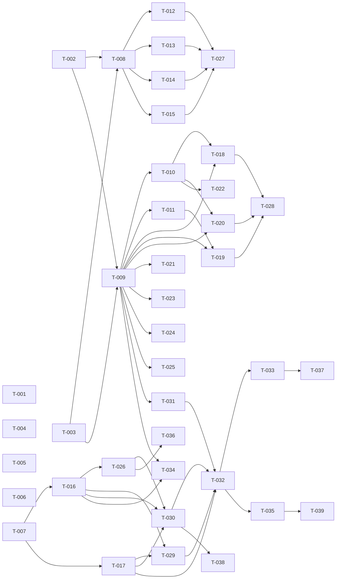

# Build Site: Cave Pi

## Source Blueprints

| Blueprint | Requirements | Acceptance Criteria |
|-----------|-------------|-------------------|
| blueprint-fork-identity.md | R1-R6 | 17 |
| blueprint-cave-mode.md | R1-R6 | 23 |
| blueprint-extension-core.md | R1-R8 | 29 |
| blueprint-extension-commands.md | R1-R14 | 57 |
| blueprint-extension-ui.md | R1-R5 | 18 |
| **Total** | **39** | **144** |

---

## Tier 0 -- No Dependencies (Start Here)

- T-001: Rename CLI binary to `cave` --> fork-identity/R1
- T-002: Rename package scope across monorepo --> fork-identity/R2
- T-003: Configure dedicated config directory --> fork-identity/R3
- T-004: Implement startup banner --> fork-identity/R4
- T-005: Set up upstream remote tracking --> fork-identity/R5
- T-006: Verify license preservation and attribution --> fork-identity/R6
- T-007: Define shared CaveKit types --> extension-core/R3

## Tier 1 -- Depends on Tier 0

- T-008: Cave mode settings manager entry (blockedBy: T-002, T-003) --> cave-mode/R3
- T-009: Extension entry point scaffold (blockedBy: T-002, T-003) --> extension-core/R1
- T-010: Extension configuration system (blockedBy: T-009) --> extension-core/R2
- T-011: Skill bundling (blockedBy: T-009) --> extension-core/R4

## Tier 2 -- Depends on Tier 1

- T-012: System prompt injection (blockedBy: T-008) --> cave-mode/R1
- T-013: Intensity toggle /cave command (blockedBy: T-008) --> cave-mode/R2
- T-014: Caveman-compressed compaction (blockedBy: T-008) --> cave-mode/R4
- T-015: Tool result compression (blockedBy: T-008) --> cave-mode/R5
- T-016: Kit parser (blockedBy: T-007) --> extension-commands/R12
- T-017: Build site parser (blockedBy: T-007) --> extension-commands/R13
- T-018: Compaction protection hook (blockedBy: T-009, T-010) --> extension-core/R5
- T-019: Resource discovery hook (blockedBy: T-009, T-011) --> extension-core/R6
- T-020: Subagent context injection hook (blockedBy: T-009, T-010) --> extension-core/R7

## Tier 3 -- Depends on Tier 2

- T-021: Help command (blockedBy: T-009) --> extension-commands/R11
- T-022: Config command (blockedBy: T-010) --> extension-commands/R9
- T-023: Progress command (blockedBy: T-009) --> extension-commands/R10
- T-024: Research command (blockedBy: T-009) --> extension-commands/R7
- T-025: Design command (blockedBy: T-009) --> extension-commands/R8
- T-026: Draft command (blockedBy: T-016) --> extension-commands/R1
- T-027: Cave mode graceful degradation testing (blockedBy: T-012, T-013, T-014, T-015) --> cave-mode/R6
- T-028: Vanilla Pi compatibility testing (blockedBy: T-018, T-019, T-020) --> extension-core/R8

## Tier 4 -- Depends on Tier 3

- T-029: Scoped context builder (blockedBy: T-016, T-017) --> extension-commands/R14
- T-030: Architect command (blockedBy: T-016, T-017, T-026) --> extension-commands/R2
- T-031: Convergence monitoring (blockedBy: T-009) --> extension-commands/R5

## Tier 5 -- Depends on Tier 4

- T-032: Build command (blockedBy: T-029, T-030, T-031, T-017) --> extension-commands/R3

## Tier 6 -- Depends on Tier 5

- T-033: Tier gate review (blockedBy: T-032) --> extension-commands/R4
- T-034: Inspect command (blockedBy: T-016, T-009) --> extension-commands/R6

## Tier 7 -- Depends on Tier 6

- T-035: Build dashboard widget (blockedBy: T-032) --> extension-ui/R1
- T-036: Kit reviewer overlay (blockedBy: T-026) --> extension-ui/R2
- T-037: Tier gate overlay (blockedBy: T-033) --> extension-ui/R3
- T-038: Dependency graph visualization (blockedBy: T-030) --> extension-ui/R4
- T-039: Keyboard shortcuts (blockedBy: T-035) --> extension-ui/R5

---

## Implementation Sequence

### T-001: Rename CLI Binary to `cave`
**Blueprint Requirement:** fork-identity/R1
**Acceptance Criteria Mapped:**
- fork-identity/R1/AC-1: `cave --version` outputs fork version
- fork-identity/R1/AC-2: `cave --help` references `cave` not `pi`
- fork-identity/R1/AC-3: All `pi` subcommands available under `cave`
**blockedBy:** none
**Effort:** S
**Description:**
1. Locate the `bin` field in the coding-agent `package.json` (currently maps `pi` to the entry script).
2. Add `cave` as a second binary name pointing to the same entry script, or rename `pi` to `cave`.
3. Update help text generator to output `cave` instead of `pi` in all usage strings.
4. Verify all subcommands (`-p`, `install`, etc.) work identically under the `cave` binary.
**Files:**
- `packages/coding-agent/package.json` (bin field)
- Help text source files in `packages/coding-agent/src/`
**Test Strategy:** Run `cave --version`, `cave --help`, and `cave -p "hello"` after build. Confirm help text says `cave` not `pi`.

### T-002: Rename Package Scope Across Monorepo
**Blueprint Requirement:** fork-identity/R2
**Acceptance Criteria Mapped:**
- fork-identity/R2/AC-1: Every `package.json` uses consistent non-upstream scope
- fork-identity/R2/AC-2: Root `package.json` references Cave Pi
- fork-identity/R2/AC-3: `npm run build` succeeds with renamed packages
**blockedBy:** none
**Effort:** M
**Description:**
1. Choose a scope (e.g., `@cavepi/` or `@cave/`) to replace `@mariozechner/`.
2. Update every `package.json` across the monorepo: name fields, dependency references, import paths.
3. Update `tsconfig.json` path mappings if they reference package names.
4. Update root `package.json` name to `cave-pi-monorepo` and description to reference Cave Pi.
5. Run `npm install` and `npm run build` to validate all cross-package references resolve.
**Files:**
- All `packages/*/package.json`
- Root `package.json`
- `tsconfig.base.json`, `tsconfig.json`
- Any import statements referencing `@mariozechner/`
**Test Strategy:** `npm run build` from root succeeds. `grep -r @mariozechner packages/` returns no results.

### T-003: Configure Dedicated Config Directory
**Blueprint Requirement:** fork-identity/R3
**Acceptance Criteria Mapped:**
- fork-identity/R3/AC-1: Default config path distinct from `~/.pi/`
- fork-identity/R3/AC-2: Env var overrides default config path
- fork-identity/R3/AC-3: Does not read/write upstream `~/.pi/`
**blockedBy:** none
**Effort:** S
**Description:**
1. Locate the config directory resolution logic (likely in `packages/coding-agent/src/` or `packages/agent/src/`).
2. Change the default from `~/.pi/` to `~/.cave/` (or similar).
3. Ensure the existing env var override mechanism (e.g., `PI_HOME` or similar) is renamed or an additional `CAVE_HOME` var is supported.
4. Verify that no code paths fall back to `~/.pi/`.
**Files:**
- Config directory resolution source files
- Environment variable references
**Test Strategy:** Launch `cave` with and without `CAVE_HOME` set. Verify config is written to `~/.cave/` by default and to the override path when set. Verify `~/.pi/` is untouched.

### T-004: Implement Startup Banner
**Blueprint Requirement:** fork-identity/R4
**Acceptance Criteria Mapped:**
- fork-identity/R4/AC-1: Banner includes Cave Pi name
- fork-identity/R4/AC-2: Banner includes token savings indicator
- fork-identity/R4/AC-3: Banner does not reference upstream Pi branding
**blockedBy:** none
**Effort:** S
**Description:**
1. Locate the startup banner rendering code (likely in `packages/coding-agent/src/`).
2. Replace upstream branding with Cave Pi name and ASCII art or text identifier.
3. Add a token savings indicator line (e.g., "Cave Mode: full | Compression: active").
4. Remove any upstream Pi product name references from the banner.
**Files:**
- Banner rendering source in `packages/coding-agent/src/`
**Test Strategy:** Launch `cave` in interactive mode. Visually confirm banner shows Cave Pi, token indicator, no upstream branding.

### T-005: Set Up Upstream Remote Tracking
**Blueprint Requirement:** fork-identity/R5
**Acceptance Criteria Mapped:**
- fork-identity/R5/AC-1: `upstream` remote points to upstream Pi repo
- fork-identity/R5/AC-2: Push URL prevents accidental pushes
- fork-identity/R5/AC-3: `git fetch upstream` works
**blockedBy:** none
**Effort:** S
**Description:**
1. Add git remote: `git remote add upstream https://github.com/badlogic/pi-mono.git`
2. Set push URL to no-push: `git remote set-url --push upstream DISABLE`
3. Verify fetch works: `git fetch upstream`
4. Document in CONTRIBUTING.md how to sync from upstream.
**Files:**
- `.git/config` (via git commands)
- `CONTRIBUTING.md` (documentation update)
**Test Strategy:** `git remote -v` shows upstream fetch URL and DISABLE push URL. `git fetch upstream` succeeds.

### T-006: Verify License Preservation and Attribution
**Blueprint Requirement:** fork-identity/R6
**Acceptance Criteria Mapped:**
- fork-identity/R6/AC-1: Root LICENSE file contains MIT text
- fork-identity/R6/AC-2: Attribution to upstream Pi project present
**blockedBy:** none
**Effort:** S
**Description:**
1. Verify the existing LICENSE file contains MIT license text (it should from the fork).
2. Add an attribution section to README.md or LICENSE acknowledging the upstream Pi project by badlogic.
**Files:**
- `LICENSE`
- `README.md`
**Test Strategy:** Inspect LICENSE for MIT text. Inspect README or LICENSE for upstream attribution.

### T-007: Define Shared CaveKit Types
**Blueprint Requirement:** extension-core/R3
**Acceptance Criteria Mapped:**
- extension-core/R3/AC-1: Kit type with domain, requirements, out-of-scope
- extension-core/R3/AC-2: Requirement type with id, name, description, acceptance criteria list
- extension-core/R3/AC-3: AcceptanceCriterion type with id, description, pass/fail status
- extension-core/R3/AC-4: BuildSite type with name, tasks, tier assignments, dependency edges
- extension-core/R3/AC-5: BuildTask type with id, name, AC refs, tier, status, retry count
- extension-core/R3/AC-6: Finding type with description, severity, requirement ref
**blockedBy:** none
**Effort:** S
**Description:**
1. Create `packages/cavekit-extension/src/types.ts`.
2. Define TypeScript interfaces/types: `Kit`, `Requirement`, `AcceptanceCriterion`, `BuildSite`, `BuildTask` (with status enum: pending/in-progress/complete/failed/blocked), `Finding` (with severity enum: P0/P1/P2/P3).
3. Export all types from the package barrel.
**Files:**
- `packages/cavekit-extension/src/types.ts`
- `packages/cavekit-extension/src/index.ts` (barrel export)
**Test Strategy:** TypeScript compilation succeeds. Types are importable from the package. Each type has all specified fields.

### T-008: Cave Mode Settings Manager Entry
**Blueprint Requirement:** cave-mode/R3
**Acceptance Criteria Mapped:**
- cave-mode/R3/AC-1: Settings schema has caveMode section with enabled, intensity, toolCompression
- cave-mode/R3/AC-2: Settings persist across sessions
- cave-mode/R3/AC-3: Settings readable by other components
**blockedBy:** T-002, T-003
**Effort:** S
**Description:**
1. Locate the settings manager in the coding-agent source (likely a JSON/TOML schema or TypeScript interface).
2. Add a `caveMode` section: `{ enabled: boolean (default true), intensity: "lite"|"full"|"ultra" (default "full"), toolCompression: boolean (default true) }`.
3. Register defaults so the section exists even without user configuration.
4. Verify the settings file is written to the Cave Pi config directory (from T-003).
**Files:**
- Settings schema/type definition in `packages/coding-agent/src/`
- Settings defaults registration
**Test Strategy:** Launch `cave`, check settings contain caveMode section with correct defaults. Change a value, restart, confirm persistence.

### T-009: Extension Entry Point Scaffold
**Blueprint Requirement:** extension-core/R1
**Acceptance Criteria Mapped:**
- extension-core/R1/AC-1: Loads on both Cave Pi and vanilla Pi without errors
- extension-core/R1/AC-2: All registered commands available after init
- extension-core/R1/AC-3: All hooks active after init
- extension-core/R1/AC-4: No errors/warnings on vanilla Pi
**blockedBy:** T-002, T-003
**Effort:** M
**Description:**
1. Create `packages/cavekit-extension/src/index.ts` as the extension entry point.
2. Export a default function matching the host agent's extension API signature.
3. Implement initialization sequence: detect host environment (Cave Pi vs vanilla Pi), load config, register commands (stubs initially), register hooks (stubs initially).
4. Add graceful detection of thin-fork features (check for caveMode settings existence).
5. Ensure no throw/error paths when running on vanilla Pi.
**Files:**
- `packages/cavekit-extension/src/index.ts`
- `packages/cavekit-extension/package.json` (entry point, dependencies)
- `packages/cavekit-extension/tsconfig.json`
**Test Strategy:** Install extension on Cave Pi -- loads without error. Install on vanilla Pi -- loads without error, logs no warnings. Verify command stubs are registered.

### T-010: Extension Configuration System
**Blueprint Requirement:** extension-core/R2
**Acceptance Criteria Mapped:**
- extension-core/R2/AC-1: Defaults when no config file exists
- extension-core/R2/AC-2: Project-local overrides global
- extension-core/R2/AC-3: All required settings exposed (model preset, tier gate mode, tier gate model, max retries, task timeout, max iterations, caveman-for-subagents, scoped context)
- extension-core/R2/AC-4: Config command shows sources (validated via T-022)
**blockedBy:** T-009
**Effort:** M
**Description:**
1. Create `packages/cavekit-extension/src/config.ts`.
2. Define config schema with all required fields and defaults.
3. Implement two-layer resolution: global (`~/.cave/cavekit.json`) then project-local (`.cavekit/config.json`).
4. Track value provenance (which source each value came from) for the config command.
5. Export a `getConfig()` function and a `getConfigWithSources()` function.
**Files:**
- `packages/cavekit-extension/src/config.ts`
**Test Strategy:** Delete all config files, call `getConfig()` -- returns defaults. Create global config with one override, verify it takes effect. Create project config with another override, verify it wins over global.

### T-011: Skill Bundling
**Blueprint Requirement:** extension-core/R4
**Acceptance Criteria Mapped:**
- extension-core/R4/AC-1: All 15 skills included in package
- extension-core/R4/AC-2: Discoverable by resource loader after init
- extension-core/R4/AC-3: Read-only at runtime
**blockedBy:** T-009
**Effort:** S
**Description:**
1. Create `packages/cavekit-extension/skills/` directory.
2. Copy or symlink all 15 CaveKit skill files into the directory.
3. In the extension entry point, register the skills directory path with the host agent's resource loader.
4. Ensure skills are served read-only (no write APIs exposed).
**Files:**
- `packages/cavekit-extension/skills/*.md`
- `packages/cavekit-extension/src/index.ts` (skill registration)
**Test Strategy:** After extension init, query host resource loader for skill list. Verify all 15 skills appear. Attempt to write to a skill file through the extension API -- should fail or not be possible.

### T-012: System Prompt Injection
**Blueprint Requirement:** cave-mode/R1
**Acceptance Criteria Mapped:**
- cave-mode/R1/AC-1: System prompt contains caveman rules when enabled
- cave-mode/R1/AC-2: No caveman rules when disabled, matches upstream
- cave-mode/R1/AC-3: Code/commits/PRs written in normal English
- cave-mode/R1/AC-4: Auto-clarity for security warnings and destructive ops
**blockedBy:** T-008
**Effort:** M
**Description:**
1. Locate the system prompt assembly logic in the coding-agent source.
2. Add a conditional injection point that checks `caveMode.enabled` from settings.
3. When enabled, append the caveman communication rules (sourced from the caveman skill) including all three intensity levels and their definitions.
4. Include explicit exceptions: code blocks, commit messages, PR descriptions use normal English; security warnings and destructive operation confirmations use normal English.
5. When disabled, skip injection entirely -- system prompt must be byte-identical to upstream.
**Files:**
- System prompt assembly source in `packages/coding-agent/src/`
- Caveman rules template (extracted from skill)
**Test Strategy:** Enable cave mode, capture system prompt, verify caveman rules present with code/PR exceptions and security auto-clarity. Disable cave mode, capture system prompt, diff against upstream -- must be identical.

### T-013: Intensity Toggle /cave Command
**Blueprint Requirement:** cave-mode/R2
**Acceptance Criteria Mapped:**
- cave-mode/R2/AC-1: Accepts lite/full/ultra/off arguments
- cave-mode/R2/AC-2: Updates active intensity for session
- cave-mode/R2/AC-3: "off" disables caveman rules for session
- cave-mode/R2/AC-4: No-arg displays current intensity
- cave-mode/R2/AC-5: Registered like /settings, /compact
**blockedBy:** T-008
**Effort:** S
**Description:**
1. Locate the slash command registration mechanism (follow pattern of `/settings`, `/compact`).
2. Register `/cave` command with argument parsing for `lite|full|ultra|off`.
3. On argument: update session-level intensity (not persisted to disk, session only). On `off`: set session intensity to disabled.
4. On no argument: display current intensity level.
5. Ensure the system prompt injection (T-012) reads session-level override when present.
**Files:**
- Command registration source in `packages/coding-agent/src/`
- New `/cave` command handler
**Test Strategy:** Run `/cave` -- shows current level. Run `/cave lite` -- confirms change. Run `/cave off` -- confirms disabled. Verify system prompt updates accordingly within same session.

### T-014: Caveman-Compressed Compaction
**Blueprint Requirement:** cave-mode/R4
**Acceptance Criteria Mapped:**
- cave-mode/R4/AC-1: Compaction prompt drops articles/filler, preserves technical substance
- cave-mode/R4/AC-2: Disabled = identical to upstream compaction prompt
- cave-mode/R4/AC-3: Branch summarization uses same modification
- cave-mode/R4/AC-4: At least 20% shorter output than upstream
**blockedBy:** T-008
**Effort:** M
**Description:**
1. Locate the compaction prompt template in the coding-agent source.
2. Add conditional modification: when `caveMode.enabled`, prepend instructions to drop articles, filler, pleasantries while preserving file paths, decisions, next steps.
3. Apply the same modification to the branch summarization prompt.
4. When disabled, use the unmodified upstream prompt verbatim.
**Files:**
- Compaction prompt source in `packages/coding-agent/src/`
- Branch summarization prompt source
**Test Strategy:** Run compaction with cave mode on and off using identical conversation input. Measure character count of both outputs. Cave mode output must be at least 20% shorter. Diff disabled output against upstream -- must be identical.

### T-015: Tool Result Compression
**Blueprint Requirement:** cave-mode/R5
**Acceptance Criteria Mapped:**
- cave-mode/R5/AC-1: ANSI codes stripped when enabled
- cave-mode/R5/AC-2: Consecutive blank lines collapsed when enabled
- cave-mode/R5/AC-3: Long outputs truncated with head+tail preservation
- cave-mode/R5/AC-4: Disabled = output passes through unmodified
- cave-mode/R5/AC-5: Never alters exit code or error status
**blockedBy:** T-008
**Effort:** M
**Description:**
1. Locate the tool execution output handler in the coding-agent source (where tool stdout/stderr is captured before being added to conversation history).
2. Add a post-processing step gated on `caveMode.toolCompression`.
3. Implement: (a) strip ANSI escape sequences, (b) collapse consecutive blank lines to one, (c) if output exceeds threshold (configurable, default ~10k chars), keep first N and last M lines with "[...truncated...]" marker.
4. Ensure the compression operates only on the conversation-facing output, never modifying the actual process exit code or error status.
5. When disabled, pass through unmodified.
**Files:**
- Tool execution output handler in `packages/coding-agent/src/` or `packages/agent/src/`
- New compression utility module
**Test Strategy:** Run a tool that produces ANSI output (e.g., `ls --color`), verify ANSI stripped. Run a tool with many blank lines, verify collapsed. Run a tool with large output (>10k chars), verify head+tail truncation. Run with compression off, verify byte-identical passthrough. Verify exit codes unchanged in all cases.

### T-016: Kit Parser
**Blueprint Requirement:** extension-commands/R12
**Acceptance Criteria Mapped:**
- extension-commands/R12/AC-1: Parses well-formed kit to Kit type
- extension-commands/R12/AC-2: Reports parse errors with line references for malformed kits
- extension-commands/R12/AC-3: Handles directory of multiple kits
**blockedBy:** T-007
**Effort:** M
**Description:**
1. Create `packages/cavekit-extension/src/parsers/kit-parser.ts`.
2. Parse markdown structure: YAML frontmatter, `### R{N}:` headings for requirements, `- [ ] AC-{N}:` lines for acceptance criteria, `## Out of Scope` section.
3. Return parsed `Kit` objects using the types from T-007.
4. On malformed input, return structured errors with line numbers (missing R-numbers, missing AC lines, etc.).
5. Add a `parseDirectory(dir: string): Kit[]` function that reads all `.md` files in a directory.
**Files:**
- `packages/cavekit-extension/src/parsers/kit-parser.ts`
- `packages/cavekit-extension/src/parsers/index.ts`
**Test Strategy:** Unit tests with well-formed kit files (verify all fields extracted), malformed files (verify error messages with line refs), and a directory of mixed files.

### T-017: Build Site Parser
**Blueprint Requirement:** extension-commands/R13
**Acceptance Criteria Mapped:**
- extension-commands/R13/AC-1: Parses well-formed build site to BuildSite type
- extension-commands/R13/AC-2: Validates dependency refs (no dangling)
- extension-commands/R13/AC-3: Detects circular dependencies
**blockedBy:** T-007
**Effort:** M
**Description:**
1. Create `packages/cavekit-extension/src/parsers/build-site-parser.ts`.
2. Parse markdown structure: `### T-{NNN}:` task headings, `blockedBy:` fields, tier headings, coverage matrix.
3. Build adjacency list from dependency edges.
4. Validate all `blockedBy` references point to existing task IDs.
5. Run cycle detection (DFS-based) and report circular dependencies as errors.
**Files:**
- `packages/cavekit-extension/src/parsers/build-site-parser.ts`
- `packages/cavekit-extension/src/parsers/index.ts`
**Test Strategy:** Unit tests with well-formed build site (verify all tasks, tiers, deps extracted), dangling refs (verify error), circular deps (verify detection and error message).

### T-018: Compaction Protection Hook
**Blueprint Requirement:** extension-core/R5
**Acceptance Criteria Mapped:**
- extension-core/R5/AC-1: SDD state (phase, kit refs, progress) survives compaction
- extension-core/R5/AC-2: No injection when no SDD workflow active
- extension-core/R5/AC-3: Does not prevent or delay compaction
**blockedBy:** T-009, T-010
**Effort:** M
**Description:**
1. Create `packages/cavekit-extension/src/hooks/compaction-protection.ts`.
2. Register a pre-compaction hook via the host agent's extension API.
3. When an SDD workflow is active, serialize critical state (current Hunt phase, active kit references, build progress) into a compact format and inject into the compaction payload.
4. When no SDD workflow is active, the hook is a no-op (returns immediately).
5. Ensure the hook is synchronous or fast-async to not delay compaction.
**Files:**
- `packages/cavekit-extension/src/hooks/compaction-protection.ts`
- `packages/cavekit-extension/src/hooks/index.ts`
**Test Strategy:** Trigger compaction during active build -- verify post-compaction context contains SDD state. Trigger compaction with no build -- verify no SDD content injected. Measure hook execution time -- must add negligible latency.

### T-019: Resource Discovery Hook
**Blueprint Requirement:** extension-core/R6
**Acceptance Criteria Mapped:**
- extension-core/R6/AC-1: Skill directory in host resource loader search paths
- extension-core/R6/AC-2: Skills appear in host skill listings
**blockedBy:** T-009, T-011
**Effort:** S
**Description:**
1. Create `packages/cavekit-extension/src/hooks/resource-discovery.ts`.
2. Register a resource discovery hook that adds the extension's `skills/` directory to the host agent's resource search paths.
3. Verify integration with the host's skill listing mechanism.
**Files:**
- `packages/cavekit-extension/src/hooks/resource-discovery.ts`
**Test Strategy:** After init, query host for available skills. Verify CaveKit skills appear in the listing.

### T-020: Subagent Context Injection Hook
**Blueprint Requirement:** extension-core/R7
**Acceptance Criteria Mapped:**
- extension-core/R7/AC-1: DESIGN.md injected into subagent context when present
- extension-core/R7/AC-2: Scoped kit sections for task-specific subagents
- extension-core/R7/AC-3: Full kit content when scoped context disabled
- extension-core/R7/AC-4: No injection when no SDD workflow active
**blockedBy:** T-009, T-010
**Effort:** M
**Description:**
1. Create `packages/cavekit-extension/src/hooks/subagent-context.ts`.
2. Register a pre-subagent-dispatch hook.
3. When SDD workflow is active: (a) check for DESIGN.md and include design constraints, (b) use scoped context builder (T-029, stubbed initially) to include only relevant kit sections, (c) if scoped context disabled in config, include all kit content.
4. When no SDD workflow active, the hook is a no-op.
**Files:**
- `packages/cavekit-extension/src/hooks/subagent-context.ts`
**Test Strategy:** Dispatch subagent during build with DESIGN.md present -- verify design info injected. Dispatch for a specific task -- verify only relevant kit sections included. Disable scoped context -- verify full kits included. No active workflow -- verify no injection.

### T-021: Help Command
**Blueprint Requirement:** extension-commands/R11
**Acceptance Criteria Mapped:**
- extension-commands/R11/AC-1: Lists all /ck:* commands with descriptions
- extension-commands/R11/AC-2: Per-command detailed help
**blockedBy:** T-009
**Effort:** S
**Description:**
1. Create `packages/cavekit-extension/src/commands/help.ts`.
2. Register `/ck:help` command.
3. No-arg: list all registered `/ck:*` commands with one-line descriptions (pull from command metadata).
4. With arg: display detailed usage for the specified command.
**Files:**
- `packages/cavekit-extension/src/commands/help.ts`
**Test Strategy:** Run `/ck:help` -- verify all commands listed. Run `/ck:help draft` -- verify detailed usage shown.

### T-022: Config Command
**Blueprint Requirement:** extension-commands/R9
**Acceptance Criteria Mapped:**
- extension-commands/R9/AC-1: No-arg displays all values with sources
- extension-commands/R9/AC-2: `/ck:config key value` updates project-local config
- extension-commands/R9/AC-3: Invalid key/value produces error
**blockedBy:** T-010
**Effort:** S
**Description:**
1. Create `packages/cavekit-extension/src/commands/config.ts`.
2. Register `/ck:config` command.
3. No-arg: call `getConfigWithSources()` and display a formatted table of key, value, source.
4. With key+value: validate the key exists in the schema, validate the value type, write to project-local config file.
5. Invalid key or value: display descriptive error.
**Files:**
- `packages/cavekit-extension/src/commands/config.ts`
**Test Strategy:** Run `/ck:config` -- verify table output with sources. Run `/ck:config maxRetries 5` -- verify update. Run `/ck:config invalidKey foo` -- verify error.

### T-023: Progress Command
**Blueprint Requirement:** extension-commands/R10
**Acceptance Criteria Mapped:**
- extension-commands/R10/AC-1: Shows task counts and current wave
- extension-commands/R10/AC-2: Shows convergence metrics when available
- extension-commands/R10/AC-3: No-build message when no build exists
**blockedBy:** T-009
**Effort:** S
**Description:**
1. Create `packages/cavekit-extension/src/commands/progress.ts`.
2. Register `/ck:progress` command.
3. Read build state (if exists): display total/completed/failed/blocked tasks and current wave.
4. Read convergence log (if exists): display latest metrics.
5. If no build state: display "No active build" message.
**Files:**
- `packages/cavekit-extension/src/commands/progress.ts`
**Test Strategy:** Run during active build -- verify counts and wave shown. Run with convergence data -- verify metrics. Run with no build -- verify message.

### T-024: Research Command
**Blueprint Requirement:** extension-commands/R7
**Acceptance Criteria Mapped:**
- extension-commands/R7/AC-1: Dispatches subagents for topic investigation
- extension-commands/R7/AC-2: Consolidated summary of results
- extension-commands/R7/AC-3: No-arg usage message
**blockedBy:** T-009
**Effort:** M
**Description:**
1. Create `packages/cavekit-extension/src/commands/research.ts`.
2. Register `/ck:research` command.
3. Parse topic from arguments. Dispatch one or more subagents using print mode (`cave -p`) with the research topic as prompt.
4. Collect results and produce a consolidated summary.
5. No-arg: display usage message.
**Files:**
- `packages/cavekit-extension/src/commands/research.ts`
**Test Strategy:** Run `/ck:research "TypeScript monorepo patterns"` -- verify subagent dispatched and summary returned. Run `/ck:research` -- verify usage message.

### T-025: Design Command
**Blueprint Requirement:** extension-commands/R8
**Acceptance Criteria Mapped:**
- extension-commands/R8/AC-1: `create` produces 9-section DESIGN.md
- extension-commands/R8/AC-2: `audit` reports section completeness
- extension-commands/R8/AC-3: No-arg shows usage
**blockedBy:** T-009
**Effort:** M
**Description:**
1. Create `packages/cavekit-extension/src/commands/design.ts`.
2. Register `/ck:design` command with subcommands `create` and `audit`.
3. `create`: dispatch a subagent with the design system skill prompt, guide user through Q&A, produce DESIGN.md with all 9 sections.
4. `audit`: read existing DESIGN.md, check for all 9 sections (visual theme, color palette, typography, components, layout, depth, dos/don'ts, responsive, agent guide), report present/incomplete/missing.
5. No-arg: display usage with subcommand list.
**Files:**
- `packages/cavekit-extension/src/commands/design.ts`
**Test Strategy:** Run `/ck:design create` -- verify DESIGN.md produced with 9 sections. Run `/ck:design audit` on partial file -- verify correct completeness report. Run `/ck:design` -- verify usage.

### T-026: Draft Command
**Blueprint Requirement:** extension-commands/R1
**Acceptance Criteria Mapped:**
- extension-commands/R1/AC-1: Generates kit files in context/kits/
- extension-commands/R1/AC-2: Kits have R-numbered requirements with AC
- extension-commands/R1/AC-3: Summary displayed after generation
- extension-commands/R1/AC-4: No-arg error message
- extension-commands/R1/AC-5: Uses CaveKit writing skill principles
**blockedBy:** T-016
**Effort:** M
**Description:**
1. Create `packages/cavekit-extension/src/commands/draft.ts`.
2. Register `/ck:draft` command.
3. Parse project description from arguments. Dispatch a subagent with the CaveKit writing skill and methodology skill context to decompose the description into domain kits.
4. Write generated kits to `context/kits/` directory with proper R-numbered requirements and AC per requirement.
5. After generation, parse the output with the kit parser (T-016) and display summary (kit count, requirement count, AC count).
6. No-arg: display usage error directing user to provide a description.
**Files:**
- `packages/cavekit-extension/src/commands/draft.ts`
**Test Strategy:** Run `/ck:draft "a todo app"` -- verify kit files created, R-numbered, with AC. Verify summary output. Run `/ck:draft` -- verify error. Inspect generated kits for writing skill principles (implementation-agnostic, testable, out-of-scope).

### T-027: Cave Mode Graceful Degradation Testing
**Blueprint Requirement:** cave-mode/R6
**Acceptance Criteria Mapped:**
- cave-mode/R6/AC-1: Disabled cave mode = identical to upstream behavior
- cave-mode/R6/AC-2: Tool compression error = fallback to original output
**blockedBy:** T-012, T-013, T-014, T-015
**Effort:** S
**Description:**
1. Set `caveMode.enabled = false` in settings.
2. Verify system prompt matches upstream exactly (diff test).
3. Verify compaction prompt matches upstream exactly (diff test).
4. Verify tool output passes through unmodified.
5. Inject a deliberate error into the tool compression pipeline. Verify the original unmodified output is returned as fallback.
**Files:**
- Test files for cave mode degradation
**Test Strategy:** Integration tests comparing disabled cave mode output against upstream Pi baseline. Error injection test for tool compression fallback.

### T-028: Vanilla Pi Compatibility Testing
**Blueprint Requirement:** extension-core/R8
**Acceptance Criteria Mapped:**
- extension-core/R8/AC-1: Loads without error on vanilla Pi
- extension-core/R8/AC-2: All slash commands functional on vanilla Pi
- extension-core/R8/AC-3: Fork-dependent features degrade silently
**blockedBy:** T-018, T-019, T-020
**Effort:** M
**Description:**
1. Set up a test environment simulating vanilla Pi (no caveMode settings, no fork-specific APIs).
2. Load the extension -- verify no errors at startup.
3. Run each `/ck:*` command -- verify all function (may have reduced features).
4. Verify no error logs or warnings related to missing fork features.
**Files:**
- Test harness/scripts for vanilla Pi simulation
**Test Strategy:** Integration test suite running all commands against a vanilla Pi mock environment. Verify zero errors in stderr/logs.

### T-029: Scoped Context Builder
**Blueprint Requirement:** extension-commands/R14
**Acceptance Criteria Mapped:**
- extension-commands/R14/AC-1: Contains only requirements mapped to the task
- extension-commands/R14/AC-2: Includes cross-references from included requirements
- extension-commands/R14/AC-3: Full kits when scoped context disabled
**blockedBy:** T-016, T-017
**Effort:** M
**Description:**
1. Create `packages/cavekit-extension/src/context/scoped-context-builder.ts`.
2. Given a `BuildTask` and the full set of `Kit` objects, extract only the requirements and acceptance criteria referenced by that task (via the build site's coverage matrix mapping).
3. When extracted requirements have cross-references to other kits, include those cross-reference sections.
4. When `scopedContext` is disabled in config, return the full content of all kits.
**Files:**
- `packages/cavekit-extension/src/context/scoped-context-builder.ts`
**Test Strategy:** Unit test: given a task mapped to 2 of 10 requirements, verify only those 2 (plus cross-refs) appear in output. Unit test: scoped context disabled, verify all kits returned.

### T-030: Architect Command
**Blueprint Requirement:** extension-commands/R2
**Acceptance Criteria Mapped:**
- extension-commands/R2/AC-1: Reads all kits from context/kits/
- extension-commands/R2/AC-2: T-numbered tasks with tiers and deps
- extension-commands/R2/AC-3: Every AC maps to at least one task
- extension-commands/R2/AC-4: Written to file in context directory
- extension-commands/R2/AC-5: No-kits error message
**blockedBy:** T-016, T-017, T-026
**Effort:** L
**Description:**
1. Create `packages/cavekit-extension/src/commands/architect.ts`.
2. Register `/ck:architect` command.
3. Read and parse all kits from `context/kits/` using the kit parser (T-016).
4. Dispatch a subagent with the architect skill context, providing all parsed kits.
5. The subagent generates a build site with T-numbered tasks, tier assignments, dependency edges, and a coverage matrix ensuring every AC maps to at least one task.
6. Parse the generated build site with the build site parser (T-017) to validate structure.
7. Write the validated build site to `context/plans/build-site.md`.
8. No-kits: display error directing user to run `/ck:draft` first.
**Files:**
- `packages/cavekit-extension/src/commands/architect.ts`
**Test Strategy:** Run `/ck:architect` with kits present -- verify build site file created with T-numbered tasks, valid tiers, valid deps. Verify coverage matrix covers all AC. Run with no kits -- verify error message.

### T-031: Convergence Monitoring
**Blueprint Requirement:** extension-commands/R5
**Acceptance Criteria Mapped:**
- extension-commands/R5/AC-1: Records iteration number, lines changed, test results, files modified
- extension-commands/R5/AC-2: Reports healthy convergence (lines decreasing, tests increasing)
- extension-commands/R5/AC-3: Detects ceiling condition
- extension-commands/R5/AC-4: Iteration capped at configured max
- extension-commands/R5/AC-5: Loop log written for cross-session persistence
**blockedBy:** T-009
**Effort:** M
**Description:**
1. Create `packages/cavekit-extension/src/execution/convergence.ts`.
2. Define a `ConvergenceRecord` type: iteration number, lines changed, test pass/fail counts, files modified list, timestamp.
3. Implement `recordIteration()` to append to the loop log (`context/impl/loop-log.json`).
4. Implement `analyzeConvergence()`: compare last N iterations, classify as healthy (lines decreasing + tests increasing), ceiling (lines plateau + tests failing), or diverging.
5. Implement max iteration cap from config -- return stop signal when exceeded.
**Files:**
- `packages/cavekit-extension/src/execution/convergence.ts`
- Loop log schema
**Test Strategy:** Unit tests: feed sequences of iteration data, verify healthy/ceiling/diverging classification. Verify max iteration cap triggers stop. Verify loop log file written and readable across sessions.

### T-032: Build Command
**Blueprint Requirement:** extension-commands/R3
**Acceptance Criteria Mapped:**
- extension-commands/R3/AC-1: Reads build site, computes waves via topological sort
- extension-commands/R3/AC-2: Tasks in same wave execute concurrently
- extension-commands/R3/AC-3: Task not dispatched until deps complete
- extension-commands/R3/AC-4: Subagent receives scoped context
- extension-commands/R3/AC-5: AC validated after each task, pass/fail marking
- extension-commands/R3/AC-6: Failed tasks retried up to max, then blocked
- extension-commands/R3/AC-7: No-build-site error message
**blockedBy:** T-029, T-030, T-031, T-017
**Effort:** L
**Description:**
1. Create `packages/cavekit-extension/src/commands/build.ts` and `packages/cavekit-extension/src/execution/wave-executor.ts`.
2. Register `/ck:build` command.
3. Read and parse the build site using the build site parser (T-017).
4. Compute execution waves via topological sort of the dependency graph.
5. For each wave: dispatch all tasks concurrently using `cave -p` (print mode) with scoped context from T-029.
6. After each task completes: validate its acceptance criteria, mark as complete or failed.
7. Failed tasks: retry up to `maxRetries` from config. After exhausting retries, mark as blocked.
8. Respect dependency ordering: never dispatch a task whose dependencies are not all complete.
9. Integrate convergence monitoring (T-031) for iterative tasks.
10. No build site: display error directing to `/ck:architect`.
**Files:**
- `packages/cavekit-extension/src/commands/build.ts`
- `packages/cavekit-extension/src/execution/wave-executor.ts`
**Test Strategy:** Integration test with a multi-tier build site. Verify waves computed correctly. Verify concurrent execution within waves. Verify dependency ordering. Verify AC validation and retry/block behavior. Verify scoped context passed to subagents. Verify no-site error.

### T-033: Tier Gate Review
**Blueprint Requirement:** extension-commands/R4
**Acceptance Criteria Mapped:**
- extension-commands/R4/AC-1: Triggered at tier completion
- extension-commands/R4/AC-2: Reviews code changes against kit requirements
- extension-commands/R4/AC-3: Findings with P0-P3 severity
- extension-commands/R4/AC-4: P0/P1 pause with approve/fix/abort options
- extension-commands/R4/AC-5: "fix" generates new tasks and re-executes tier
- extension-commands/R4/AC-6: "off" mode skips review
- extension-commands/R4/AC-7: Default self-review, configurable cross-model
**blockedBy:** T-032
**Effort:** L
**Description:**
1. Create `packages/cavekit-extension/src/execution/tier-gate.ts`.
2. Hook into the wave executor (T-032) at tier boundaries.
3. When the last task in a tier completes, dispatch a review subagent that: examines git diff for the tier's changes, compares against relevant kit requirements, produces findings with P0-P3 severity.
4. If P0 or P1 findings exist: pause build, present user with approve/fix/abort.
5. On "fix": generate new tasks for each P0/P1 finding, add to current tier, re-execute.
6. On "approve": continue to next tier. On "abort": stop build.
7. When `tierGateMode` is "off": skip review entirely.
8. Default: use current model for self-review. When `tierGateModel` is set: use that model for cross-model adversarial review.
**Files:**
- `packages/cavekit-extension/src/execution/tier-gate.ts`
**Test Strategy:** Integration test: complete a tier with intentional issues, verify review triggered with correct severity findings. Test approve/fix/abort paths. Test "off" mode skips review. Test alternative model configuration.

### T-034: Inspect Command
**Blueprint Requirement:** extension-commands/R6
**Acceptance Criteria Mapped:**
- extension-commands/R6/AC-1: Reads kits and examines codebase
- extension-commands/R6/AC-2: Classifies AC as met/partial/not met
- extension-commands/R6/AC-3: Flags over-builds
- extension-commands/R6/AC-4: P0-P3 severity findings
- extension-commands/R6/AC-5: No-kits error
**blockedBy:** T-016, T-009
**Effort:** M
**Description:**
1. Create `packages/cavekit-extension/src/commands/inspect.ts`.
2. Register `/ck:inspect` command.
3. Read and parse all kits. Dispatch a subagent to analyze the codebase against each acceptance criterion.
4. Classify each AC as met, partially met, or not met.
5. Identify code that does not trace to any requirement (over-build detection).
6. Assign P0-P3 severity to findings consistent with the tier gate scale.
7. No-kits: display error message.
**Files:**
- `packages/cavekit-extension/src/commands/inspect.ts`
**Test Strategy:** Run `/ck:inspect` on a partially implemented codebase. Verify AC classifications. Verify over-build detection for untraced code. Verify severity assignments. Run with no kits -- verify error.

### T-035: Build Dashboard Widget
**Blueprint Requirement:** extension-ui/R1
**Acceptance Criteria Mapped:**
- extension-ui/R1/AC-1: Visible during active build, updates on status change
- extension-ui/R1/AC-2: Shows wave number, task id/name/status
- extension-ui/R1/AC-3: Aggregate progress (completed/total, blocked count)
- extension-ui/R1/AC-4: Toggleable without interrupting build
**blockedBy:** T-032
**Effort:** M
**Description:**
1. Create `packages/cavekit-extension/src/ui/build-dashboard.ts`.
2. Register a TUI widget via the host agent's widget API.
3. Subscribe to build state events from the wave executor (T-032).
4. Render: current wave N/M, per-task rows (ID, name, status with color coding), aggregate bar (completed/total, blocked count).
5. Implement toggle visibility (keybinding registered in T-039).
**Files:**
- `packages/cavekit-extension/src/ui/build-dashboard.ts`
**Test Strategy:** Run a build and observe dashboard updates in real time. Toggle off -- verify hidden. Toggle on -- verify restored. Verify all status transitions displayed.

### T-036: Kit Reviewer Overlay
**Blueprint Requirement:** extension-ui/R2
**Acceptance Criteria Mapped:**
- extension-ui/R2/AC-1: Navigable tree of kits > requirements > AC
- extension-ui/R2/AC-2: Approve/reject individual kits
- extension-ui/R2/AC-3: Blocks progression until review confirmed
- extension-ui/R2/AC-4: Rejected kits excluded from architect
**blockedBy:** T-026
**Effort:** M
**Description:**
1. Create `packages/cavekit-extension/src/ui/kit-reviewer.ts`.
2. Register an overlay via the host agent's overlay API.
3. After `/ck:draft` completes, display a tree view: kits at top level, requirements as children, AC as leaves.
4. Allow keyboard navigation and approve/reject per kit.
5. Block workflow progression until the user confirms all review decisions.
6. Write approval state to a manifest file. The architect command (T-030) reads this manifest to filter rejected kits.
**Files:**
- `packages/cavekit-extension/src/ui/kit-reviewer.ts`
**Test Strategy:** Generate kits, verify overlay appears with correct tree. Navigate and reject one kit. Confirm progression blocked until review done. Run architect -- verify rejected kit excluded.

### T-037: Tier Gate Overlay
**Blueprint Requirement:** extension-ui/R3
**Acceptance Criteria Mapped:**
- extension-ui/R3/AC-1: Displays findings with severity and description
- extension-ui/R3/AC-2: Three action options (approve/fix/abort)
- extension-ui/R3/AC-3: Action dispatches build behavior per R4
- extension-ui/R3/AC-4: Blocks build until action selected
**blockedBy:** T-033
**Effort:** M
**Description:**
1. Create `packages/cavekit-extension/src/ui/tier-gate-overlay.ts`.
2. Register an overlay via the host agent's overlay API.
3. When the tier gate (T-033) produces P0/P1 findings, display the overlay with: each finding (severity badge, description), three action buttons (approve, fix, abort).
4. Block build progression until user selects an action.
5. Dispatch the selected action back to the tier gate handler.
**Files:**
- `packages/cavekit-extension/src/ui/tier-gate-overlay.ts`
**Test Strategy:** Trigger a tier gate with P0 findings. Verify overlay shows findings with correct severity. Select each action -- verify correct build behavior follows. Verify build blocked until action selected.

### T-038: Dependency Graph Visualization
**Blueprint Requirement:** extension-ui/R4
**Acceptance Criteria Mapped:**
- extension-ui/R4/AC-1: Tasks grouped by tier with dependency edges
- extension-ui/R4/AC-2: Each task shows ID and name
- extension-ui/R4/AC-3: Directional edges from dependency to dependent
**blockedBy:** T-030
**Effort:** S
**Description:**
1. Create `packages/cavekit-extension/src/ui/dep-graph.ts`.
2. After `/ck:architect` produces a build site, render a text-based or TUI visualization showing tasks grouped by tier columns.
3. Display task ID and name in each node.
4. Draw directional edges (arrows) from dependency to dependent.
5. Use the host agent's rendering capabilities (or ASCII art as fallback).
**Files:**
- `packages/cavekit-extension/src/ui/dep-graph.ts`
**Test Strategy:** Generate a build site with multiple tiers. Verify visualization shows correct grouping, task labels, and directional edges.

### T-039: Keyboard Shortcuts
**Blueprint Requirement:** extension-ui/R5
**Acceptance Criteria Mapped:**
- extension-ui/R5/AC-1: Shortcut toggles build dashboard
- extension-ui/R5/AC-2: Uses host agent's shortcut mechanism
- extension-ui/R5/AC-3: No conflicts with host shortcuts
**blockedBy:** T-035
**Effort:** S
**Description:**
1. Create `packages/cavekit-extension/src/ui/shortcuts.ts`.
2. Register keyboard shortcuts via the host agent's shortcut registration API.
3. Register a shortcut for toggling the build dashboard (e.g., Ctrl+B or similar, avoiding conflicts with host built-in shortcuts).
4. Query host for existing shortcuts to avoid conflicts.
**Files:**
- `packages/cavekit-extension/src/ui/shortcuts.ts`
**Test Strategy:** Press the shortcut during a build -- verify dashboard toggles. Verify no conflict warnings from host. Verify shortcut appears in host's shortcut help.

---

## Coverage Matrix

Every acceptance criterion must map to at least one task. Gaps are marked with **GAP**.

### fork-identity

| Requirement | AC | Task(s) |
|---|---|---|
| R1 | AC-1: cave --version outputs fork version | T-001 |
| R1 | AC-2: cave --help references cave | T-001 |
| R1 | AC-3: All pi subcommands available under cave | T-001 |
| R2 | AC-1: Consistent non-upstream scope | T-002 |
| R2 | AC-2: Root package.json references Cave Pi | T-002 |
| R2 | AC-3: npm run build succeeds | T-002 |
| R3 | AC-1: Distinct default config path | T-003 |
| R3 | AC-2: Env var override | T-003 |
| R3 | AC-3: No upstream config dir access | T-003 |
| R4 | AC-1: Banner includes Cave Pi name | T-004 |
| R4 | AC-2: Token savings indicator | T-004 |
| R4 | AC-3: No upstream branding | T-004 |
| R5 | AC-1: upstream remote configured | T-005 |
| R5 | AC-2: Push prevention | T-005 |
| R5 | AC-3: git fetch upstream works | T-005 |
| R6 | AC-1: MIT license file | T-006 |
| R6 | AC-2: Attribution to upstream | T-006 |

### cave-mode

| Requirement | AC | Task(s) |
|---|---|---|
| R1 | AC-1: Caveman rules in system prompt when enabled | T-012 |
| R1 | AC-2: No rules when disabled, matches upstream | T-012, T-027 |
| R1 | AC-3: Code/commits/PRs in normal English | T-012 |
| R1 | AC-4: Auto-clarity for security/destructive ops | T-012 |
| R2 | AC-1: /cave accepts lite/full/ultra/off | T-013 |
| R2 | AC-2: Updates session intensity | T-013 |
| R2 | AC-3: "off" disables rules for session | T-013 |
| R2 | AC-4: No-arg displays current level | T-013 |
| R2 | AC-5: Registered like /settings, /compact | T-013 |
| R3 | AC-1: Settings schema with enabled/intensity/toolCompression | T-008 |
| R3 | AC-2: Persists across sessions | T-008 |
| R3 | AC-3: Readable by other components | T-008 |
| R4 | AC-1: Compaction drops articles/filler, preserves substance | T-014 |
| R4 | AC-2: Disabled = upstream compaction prompt | T-014, T-027 |
| R4 | AC-3: Branch summarization uses same modification | T-014 |
| R4 | AC-4: At least 20% shorter | T-014 |
| R5 | AC-1: ANSI codes stripped | T-015 |
| R5 | AC-2: Blank lines collapsed | T-015 |
| R5 | AC-3: Long output truncated with head+tail | T-015 |
| R5 | AC-4: Disabled = unmodified passthrough | T-015, T-027 |
| R5 | AC-5: Never alters exit code | T-015 |
| R6 | AC-1: Disabled = identical to upstream | T-027 |
| R6 | AC-2: Error fallback to original output | T-027 |

### extension-core

| Requirement | AC | Task(s) |
|---|---|---|
| R1 | AC-1: Loads on Cave Pi and vanilla Pi | T-009, T-028 |
| R1 | AC-2: All commands available after init | T-009 |
| R1 | AC-3: All hooks active after init | T-009 |
| R1 | AC-4: No errors on vanilla Pi | T-009, T-028 |
| R2 | AC-1: Defaults when no config | T-010 |
| R2 | AC-2: Project overrides global | T-010 |
| R2 | AC-3: All settings exposed | T-010 |
| R2 | AC-4: Config command shows sources | T-022 |
| R3 | AC-1: Kit type | T-007 |
| R3 | AC-2: Requirement type | T-007 |
| R3 | AC-3: AcceptanceCriterion type | T-007 |
| R3 | AC-4: BuildSite type | T-007 |
| R3 | AC-5: BuildTask type | T-007 |
| R3 | AC-6: Finding type | T-007 |
| R4 | AC-1: All 15 skills included | T-011 |
| R4 | AC-2: Discoverable by resource loader | T-011, T-019 |
| R4 | AC-3: Read-only at runtime | T-011 |
| R5 | AC-1: SDD state survives compaction | T-018 |
| R5 | AC-2: No injection when inactive | T-018 |
| R5 | AC-3: No delay to compaction | T-018 |
| R6 | AC-1: Skill dir in search paths | T-019 |
| R6 | AC-2: Skills appear in listings | T-019 |
| R7 | AC-1: DESIGN.md injected | T-020 |
| R7 | AC-2: Scoped kit sections | T-020 |
| R7 | AC-3: Full when disabled | T-020 |
| R7 | AC-4: No injection when inactive | T-020 |
| R8 | AC-1: Loads without error on vanilla Pi | T-028 |
| R8 | AC-2: All commands work on vanilla Pi | T-028 |
| R8 | AC-3: Fork features degrade silently | T-028 |

### extension-commands

| Requirement | AC | Task(s) |
|---|---|---|
| R1 | AC-1: Generates kit files | T-026 |
| R1 | AC-2: R-numbered requirements with AC | T-026 |
| R1 | AC-3: Summary displayed | T-026 |
| R1 | AC-4: No-arg error | T-026 |
| R1 | AC-5: Writing skill principles | T-026 |
| R2 | AC-1: Reads kits from context/kits/ | T-030 |
| R2 | AC-2: T-numbered tasks with tiers/deps | T-030 |
| R2 | AC-3: Full AC coverage | T-030 |
| R2 | AC-4: Written to file | T-030 |
| R2 | AC-5: No-kits error | T-030 |
| R3 | AC-1: Reads build site, topological sort | T-032 |
| R3 | AC-2: Concurrent wave execution | T-032 |
| R3 | AC-3: Dependency ordering enforced | T-032 |
| R3 | AC-4: Scoped context to subagents | T-032 |
| R3 | AC-5: AC validation after task | T-032 |
| R3 | AC-6: Retry + block on failure | T-032 |
| R3 | AC-7: No-site error | T-032 |
| R4 | AC-1: Triggered at tier end | T-033 |
| R4 | AC-2: Reviews changes vs kits | T-033 |
| R4 | AC-3: P0-P3 severity | T-033 |
| R4 | AC-4: P0/P1 pause with options | T-033 |
| R4 | AC-5: Fix generates tasks | T-033 |
| R4 | AC-6: Off mode | T-033 |
| R4 | AC-7: Default self-review, configurable | T-033 |
| R5 | AC-1: Records iteration data | T-031 |
| R5 | AC-2: Healthy convergence report | T-031 |
| R5 | AC-3: Ceiling detection | T-031 |
| R5 | AC-4: Max iteration cap | T-031 |
| R5 | AC-5: Loop log persistence | T-031 |
| R6 | AC-1: Reads kits and codebase | T-034 |
| R6 | AC-2: AC classification | T-034 |
| R6 | AC-3: Over-build flags | T-034 |
| R6 | AC-4: P0-P3 severity | T-034 |
| R6 | AC-5: No-kits error | T-034 |
| R7 | AC-1: Dispatches subagents | T-024 |
| R7 | AC-2: Consolidated summary | T-024 |
| R7 | AC-3: No-arg error | T-024 |
| R8 | AC-1: Create produces DESIGN.md | T-025 |
| R8 | AC-2: Audit reports sections | T-025 |
| R8 | AC-3: No-arg usage | T-025 |
| R9 | AC-1: Display all with sources | T-022 |
| R9 | AC-2: Set key/value | T-022 |
| R9 | AC-3: Invalid key error | T-022 |
| R10 | AC-1: Task counts and wave | T-023 |
| R10 | AC-2: Convergence metrics | T-023 |
| R10 | AC-3: No-build message | T-023 |
| R11 | AC-1: Lists all commands | T-021 |
| R11 | AC-2: Per-command help | T-021 |
| R12 | AC-1: Parses to Kit type | T-016 |
| R12 | AC-2: Reports malformed errors | T-016 |
| R12 | AC-3: Handles directory | T-016 |
| R13 | AC-1: Parses to BuildSite type | T-017 |
| R13 | AC-2: Validates deps | T-017 |
| R13 | AC-3: Detects cycles | T-017 |
| R14 | AC-1: Scoped to task requirements only | T-029 |
| R14 | AC-2: Includes cross-refs | T-029 |
| R14 | AC-3: Full when disabled | T-029 |

### extension-ui

| Requirement | AC | Task(s) |
|---|---|---|
| R1 | AC-1: Visible during build, updates | T-035 |
| R1 | AC-2: Shows wave, task id/name/status | T-035 |
| R1 | AC-3: Aggregate progress | T-035 |
| R1 | AC-4: Toggleable | T-035, T-039 |
| R2 | AC-1: Navigable tree | T-036 |
| R2 | AC-2: Approve/reject | T-036 |
| R2 | AC-3: Blocks progression | T-036 |
| R2 | AC-4: Rejected excluded | T-036 |
| R3 | AC-1: Findings with severity | T-037 |
| R3 | AC-2: Three action options | T-037 |
| R3 | AC-3: Action dispatches | T-037 |
| R3 | AC-4: Blocks build | T-037 |
| R4 | AC-1: Tasks grouped by tier | T-038 |
| R4 | AC-2: Shows ID and name | T-038 |
| R4 | AC-3: Directional edges | T-038 |
| R5 | AC-1: Dashboard toggle shortcut | T-039 |
| R5 | AC-2: Host shortcut mechanism | T-039 |
| R5 | AC-3: No conflicts | T-039 |

**Coverage: 144/144 acceptance criteria mapped. 0 gaps.**

---

## Task Summary

| Tier | Tasks | Effort |
|------|-------|--------|
| 0 | T-001 through T-007 (7 tasks) | 5S + 1M = ~7 hrs |
| 1 | T-008 through T-011 (4 tasks) | 2S + 2M = ~6 hrs |
| 2 | T-012 through T-020 (9 tasks) | 2S + 7M = ~16 hrs |
| 3 | T-021 through T-028 (8 tasks) | 4S + 4M = ~12 hrs |
| 4 | T-029 through T-031 (3 tasks) | 2M + 1L = ~8 hrs |
| 5 | T-032 (1 task) | 1L = ~4 hrs |
| 6 | T-033 through T-034 (2 tasks) | 1M + 1L = ~6 hrs |
| 7 | T-035 through T-039 (5 tasks) | 1S + 4M = ~9 hrs |
| **Total** | **39 tasks** | **~68 hrs** |

---

## Dependency Graph

